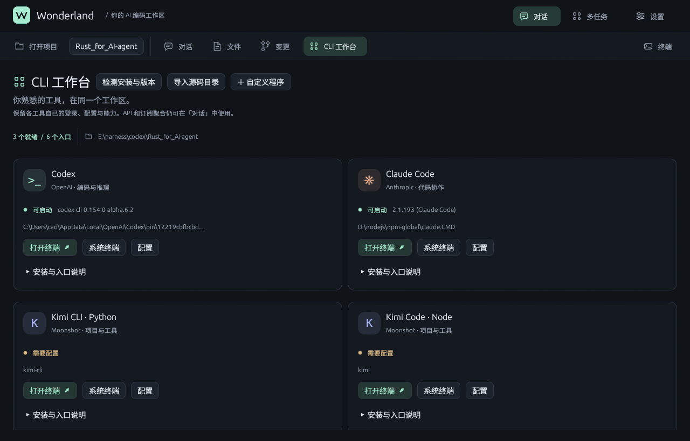

# Wonderland · Rust AI Agent

Wonderland 是支持多模型 API 与订阅账号的 Rust 编码工作区，提供 Windows 桌面应用、原生 CLI、npm CLI 和本地 HTTP 服务。当前开发版本 **0.8.0（工作台预览版）**。

本版开始实现[多模型协作建设方案](docs/MULTI_MODEL_ORCHESTRATION_PLAN.md)与[桌面产品方案](docs/DESKTOP_PRODUCT_PLAN.md)。新增 Work/Chat、持久任务看板、项目、官方应用入口、Codex app-server 与 Kimi Wire 任务适配、权限往返及验收记录。模型执行由对应原生工具承担，原工具源码不作修改。

**自动多模型派工尚未启用。** LiveBench 每次在线刷新已实现，实时官方价格解析、模型身份到评分的映射、任务 DAG、预算账本、隔离工作树与自动集成还未完成。其它应用当前通过交互终端使用，不能视为已有受管适配器。插件市场、定时任务、远程主机、PR 与网站面板仍属于后续范围。详见 [0.8.0 实现边界与使用说明](docs/RELEASE-0.8.0.md)。


## 已有基础能力

- **项目工作台**：文件浏览与编辑、Git 变更、最近项目、内嵌终端和系统终端；按项目保留任务目录与运行中会话。
- **官方 CLI 直连**：直接打开 Codex、Claude Code、Kimi CLI/Code、DeepSeek Harness 和自定义程序，保留原工具的登录、配置与升级方式。
- **实时输出**：Chat Completions、OpenAI Responses、Anthropic Messages 的 SSE 统一到文本、推理、工具调用和用量事件；CLI 默认流式，桌面实时显示并可取消。断流会明确报告失败。
- **模型协议适配**：GPT-5 / Codex 使用 Responses，保存加密推理原始封装与缓存键；Claude 使用 Messages，保留 thinking 签名与 redacted thinking，设置缓存断点；DeepSeek / Kimi 保留工具续轮的 reasoning_content，按能力发送 thinking 参数。
- **桌面工作区**：深色中文界面、代码块复制、会话恢复、模型目录、推理档位、权限确认、API 配置、订阅登录、MCP 状态和检索面板。Ctrl+Enter 发送，Enter 换行。
- **操作系统隔离执行**：`SandboxRun` / sandbox API 支持 Python、Node；Windows AppContainer + Job Object，Linux bubblewrap，macOS sandbox-exec。缺少隔离机制时拒绝执行。
- **MCP**：stdio、Streamable HTTP、旧版 HTTP+SSE；tools、resources、prompts；OAuth 元数据发现、动态客户端注册、PKCE、浏览器授权、令牌刷新和热重载。
- **会话检索**：SQLite FTS5 trigram 索引，支持中文及子串查询、用户过滤、命中片段；短词回退 LIKE；会话 JSON 为原始记录，索引可重建。
- **CLIProxyAPI 7.3.7**：分发原版 sidecar，复用订阅授权、账号刷新、额度与轮换能力；管理 API 可通过本服务完整转发，无须移植上游 Go 代码。

协议适配不等于复现官方客户端的全部行为。模型效果还受模型版本、账号额度、提示词、工具和网络影响。Kimi 已使用订阅账号完成真实流式、读取、修改、再读取及推理续聊测试；OpenAI、Claude、DeepSeek 目前为模拟协议回归验证，未宣称与官方客户端效率相同。详见 [验证记录](docs/VALIDATION-0.7.0.md)。

## Windows 桌面安装

从 [GitHub Releases](https://github.com/Alice-Marx/Rust_for_AI-agent/releases) 下载：

- `Wonderland-Setup-0.7.0-x64.exe`：当前用户安装程序，含桌面、服务、原生 CLI 和 CLIProxyAPI。
- `Wonderland-0.7.0-windows-x64.zip`：便携包，解压后运行 `Start-Wonderland.ps1`。
- `SHA256SUMS.txt`：产物 SHA-256 校验值。

开始菜单的 Wonderland 快捷方式启动本地服务和桌面。默认服务地址为 `http://127.0.0.1:8080`，程序安装到 `%LOCALAPPDATA%\Programs\Wonderland`，数据保存在 `%LOCALAPPDATA%\WonderlandData`。升级和卸载保留用户数据。安装程序未进行代码签名。

### 桌面工作台

桌面应用顶部的工作区栏把对话、文件、Git 变更和 CLI 工作台放在同一个项目目录下。点击“打开项目”选择目录后，文件浏览器会识别 Rust、Python、JavaScript/TypeScript、Go、Java、Kotlin 和 C# 等常见项目，并对文本文件提供编辑、原子保存和外部修改提示。

点击“终端”可打开内嵌 VT100/xterm 终端。终端使用当前用户权限运行，支持 Unicode、中文输入、粘贴、方向键、Ctrl+C、鼠标协议、替代屏幕和多个会话；终端不是 Agent 的安全沙箱。也可以点击“系统终端”在操作系统终端中打开同一工作区。

“CLI 工作台”会检测 PATH 和常见安装目录中的工具，并通过“导入源码目录”添加本地已构建的入口。内置入口包括 Codex、Claude Code、Kimi CLI（Python）、Kimi Code（Node）、DeepSeek Harness 和 Wonderland CLI。选择“在内置终端打开”或“在系统终端打开”即可直接调用原程序；登录、账号、模型、权限和工具行为仍由各自官方 CLI 管理，桌面不会修改这些项目的源码。源码目录导入只保存入口配置，不会自动安装依赖或构建项目。

本地 `claude-code` 分支与官方 Claude Code 会在列表中明确区分；Kimi Python 与 Kimi Node 可能都提供 `kimi` 命令，工作台会通过入口和版本指纹避免误启动。可以在“配置路径与参数”中为自定义 CLI 指定解释器和参数数组；启动目录使用当前工作区。

终端和 CLI 会话会保留在各自启动时的工作目录。切换项目时，正在运行的任务不会被重定向；有历史的任务会继续显示原目录，新项目会创建新的任务上下文。关闭窗口前，桌面会提示未保存文件、运行中的 Agent 任务和终端进程。

工作台使用原创矢量图标和高对比深色主题，支持 940×620 小窗口；终端渲染层兼容常见 VT100/xterm 控制序列，不宣称支持 Kitty、sixel 等所有终端扩展。




### API 密钥方式

在“设置与连接 → 模型与账号”选择 OpenAI、Anthropic、DeepSeek、Kimi 等，填写 API 密钥和模型，点击“保存并应用连接”。API 地址留空使用预设官方地址，高级协议通常保持自动。

密钥通过本地服务保存；Windows 使用当前用户 DPAPI 加密，Unix 使用私有目录和 0600 文件权限。返回桌面的配置只包含 `has_api_key`，不包含密钥。连接更改应用于后续任务，执行中的任务保留原提供商。

### 订阅账号方式

选择“订阅账号 · CLIProxyAPI”，保存并应用。在“订阅账号登录”选择 Codex、Claude 或 Kimi，点击登录，在浏览器完成授权，然后检查登录并刷新模型。

账户是否可调用模型由对应提供商的订阅与授权服务决定。账号令牌由 CLIProxyAPI 存储到用户数据目录的 `CLIProxyAPI/auth`，不会打进安装包或 npm 包。主服务会缓存已完成登录状态，避免上游短时状态过期导致误报。

CLI 同样支持：

```powershell
wonderland-cli login kimi --wait
wonderland-cli accounts
wonderland-cli models
wonderland-cli --model kimi-k2.5 --cwd E:/my-project chat
```

## npm CLI

需要 Node.js 18+，以及已启动的 Wonderland 服务。npm 包是服务客户端，不包含 Rust 后端。Windows 安装包已经附带原生 CLI，也可以安装 npm 客户端：

```powershell
npm install -g rust-ai-wonderland-cli
wonderland-cli --version
wonderland-cli health
wonderland-cli --cwd E:/my-project --model kimi-k2.5 --reasoning on chat
wonderland-cli --continue chat
wonderland-cli search "模型适配"
wonderland-cli profile --model gpt-5.4
```

发布前可安装本地包：`npm install -g ./dist/rust-ai-wonderland-cli-0.7.0.tgz`。命令别名为 `wonderland`、`wonderland-cli`；原生 `wonderland.exe` 是后端服务，因此安装两种 CLI 后建议使用 `wonderland-cli` 并检查 PATH 顺序。

原生 CLI 使用 `wonderland-cli --model gpt-5.4 profile`（全局参数放在子命令前）。`--no-stream` 等待完整回答，`--reasoning` 按模型能力选择档位。交互终端会询问需要批准的工具参数；重定向/非交互终端不会擅自批准。

## 权限与执行边界

| 模式 | 行为 |
| --- | --- |
| `default` | 工作区内文件读取/搜索默认允许，写入、宿主命令等逐项确认 |
| `plan` | 只读操作，禁止修改 |
| `acceptEdits` | 允许非破坏性文件编辑，宿主 Bash 仍须确认 |
| `dontAsk` | 无明确允许规则的操作拒绝 |
| `bypassPermissions` | 跳过询问；显式拒绝及受保护路径限制仍生效 |

`.claude/settings.json` / `.wonderland/settings.json` 中的 permissions deny/ask 规则优先于默认读取许可。读取目标先 canonicalize，工作区外文件需要确认。文件编辑保留“先读后写”和过期内容检测。

**SandboxRun 只隔离该工具提交的代码。Bash、文件工具、MCP 子进程和 hooks 并未被整个应用沙箱包裹。** 运行不受信任的项目或 MCP 时仍须审查其配置。Windows AppContainer 没有网络 capability，仅授权临时执行目录，进程受内存、数量、超时及输出限制。Python/Node 解释器需已安装在 PATH。

Linux 需安装 `bubblewrap`，macOS 使用系统 `sandbox-exec`；这两个平台尚未在本次 Windows 本机实测。Unix 内存与进程数配额尚未等同 Windows Job Object，不把配置值当作已生效限制。API 返回本次实际 isolation 与 limits。

```powershell
$env:AGENT_ENABLE_SANDBOX='true' # 服务默认开启隔离代码执行；false 可禁用
$env:AGENT_SANDBOX_TIMEOUT_MS='10000'
$env:AGENT_SANDBOX_MEMORY_MB='512'
$env:AGENT_SANDBOX_MAX_PROCESSES='8'
```

宿主 Bash 的取消/超时使用进程树生命周期控制；这是清理机制，不是安全隔离。

## MCP 配置与授权

在工作目录创建 `.mcp.json`：

```json
{
  "mcpServers": {
    "local": {"command": "node", "args": ["./mcp-server.js"]},
    "remote": {"type": "http", "url": "https://mcp.example.com/mcp", "oauth": {}},
    "legacy": {"type": "sse", "url": "https://mcp.example.com/sse"}
  }
}
```

HTTP 配置不需要 command。不支持动态注册的授权服务器需要 `oauth.client_id`，可配置 `authorization_server`、`scopes`。OAuth 使用浏览器和本机临时回调端口，凭据保存在私有存储；登出删除本机令牌。授权后在 GUI 点击重新连接，或：

```powershell
wonderland-cli --cwd E:/my-project mcp-login remote
wonderland-cli --cwd E:/my-project mcp-reload
wonderland-cli mcp
```

npm 登录命令加 `--wait` 自动等待完成并重载。服务根据 MCP capability 注册 resources/prompts 工具。MCP reload 替换注册表并释放旧 stdio/SSE 会话。高级 MCP 功能（如 sampling、elicitation、服务通知驱动工具更新）不在本版本范围。

## 源码运行

需要 Rust stable、C/C++ 链接工具链；Windows 推荐 MSVC Build Tools 或 GCC/MinGW。Linux 桌面需要 X11/Wayland 开发依赖。上游 AI 编码工具收录在 [anytool/](anytool/)，按 Kimi、ChatGPT、Claude、MiniMax、MiMo 和 Z.ai 分组；其中 `Claude/` 保存从 Gitee 导入的完整项目文件，其余通过 Git 子模块收录，获取方式见目录内说明。这些工具不参与主项目编译。此前在根目录检出的本地参考仓库仍独立保留。

```powershell
cargo test --locked --all-targets
$env:AGENT_PROVIDER='subscription'
cargo run --bin wonderland
# 新终端
cargo run --bin wonderland-desktop
```

也可以设置 `AGENT_PROVIDER=offline` 启动不调用模型的演示。API 环境配置示例：

```powershell
$env:AGENT_PROVIDER='deepseek'
$env:DEEPSEEK_API_KEY='your-key'
$env:DEEPSEEK_MODEL='deepseek-chat'
cargo run --bin wonderland
```

已保存的 GUI 连接优先于提供商环境变量。使用独立 `AGENT_DATA_DIR` 可创建独立配置。常用环境变量：

| 配置 | 说明 |
| --- | --- |
| `AGENT_DATA_DIR` | 会话、索引、API 配置根目录；源码默认为 `.agent-data` |
| `AGENT_ADDR` / `AGENT_SERVER_URL` | 服务监听 / 客户端连接地址 |
| `WONDERLAND_SERVER_TOKEN` | 服务与客户端共用 Bearer token；监听非本机地址必须配置 |
| `AGENT_PROVIDER` | subscription、openai、anthropic、deepseek、kimi、qwen、glm、gemini、openrouter、ollama、offline 等 |
| `OPENAI_API_KEY` / `OPENAI_BASE_URL` / `OPENAI_MODEL` | OpenAI API 配置 |
| `ANTHROPIC_API_KEY` / `ANTHROPIC_BASE_URL` / `ANTHROPIC_MODEL` | Claude 原生 Messages 配置；地址包含 `/v1` |
| `AGENT_MODEL` / `AGENT_REASONING_EFFORT` | CLI 默认模型与推理选择 |
| `AGENT_MODEL_PROFILE` / `AGENT_CONTEXT_WINDOW` / `AGENT_MAX_OUTPUT_TOKENS` | 能力档案与上下文/输出上限覆盖 |
| `AGENT_WIRE` | chat / responses / anthropic；通常自动选择 |
| `CLIPROXYAPI_BIN` / `CLIPROXYAPI_DATA_DIR` / `CLIPROXYAPI_PORT` | 内置 sidecar 路径、数据目录与端口 |
| `CLIPROXYAPI_BASE_URL` / `CLIPROXYAPI_API_KEY` | 使用外部代理；同时设置管理 URL/key 以使用登录功能 |

API 客户端只接受 HTTPS 或本机 HTTP。服务防止不匹配的浏览器 Origin 请求；部署到远程时应增加 TLS、网络访问控制，服务不是多租户身份管理系统。

## HTTP 接口

| 接口 | 用途 |
| --- | --- |
| `GET /health` | 服务、当前模型、协议及沙箱状态 |
| `GET/PUT /v1/connection` | 查看脱敏连接 / 保存并应用连接 |
| `GET /v1/models`, `/v1/models/profile?model=...` | 当前提供商目录及能力档案 |
| `POST /v1/agent/stream` | SSE 任务；`x-wonderland-interactive: true` 开启批准事件 |
| `POST /v1/permissions/{id}` | `{ "allow": true }`，一次性批准；拒绝、断连或超时关闭请求 |
| `POST /v1/agent/run` | 非流式任务，需要询问的操作拒绝 |
| `GET /v1/sessions`, `/v1/sessions/{id}` | 会话列表与历史 |
| `GET /v1/sessions/search?q=...&user_id=...` | SQLite 检索 |
| `GET /v1/tools`, `/v1/mcp/servers` | 工具与 MCP 状态 |
| `POST /v1/mcp/reload` | `{ "cwd": "..." }` 热重载 |
| `POST/DELETE /v1/mcp/{name}/login` | MCP OAuth 登录 / 登出 |
| `GET /v1/mcp/login/status?state=...` | MCP 授权状态 |
| `POST /v1/sandbox/execute` | `{ "language": "python", "code": "print(1)" }` |
| `/v1/providers/cliproxyapi/*` | accounts、models、verify、login、login/status |
| `/v1/providers/cliproxyapi/management/{path}` | 原版 `/v0/management/{path}` 代理；保留方法、查询与响应体 |

SSE 数据形状为 `{"frame":"event","event":{"type":"text_delta","text":"..."}}`，最终 `frame=response` 携带完整任务结果；错误为 `frame=error`。仅在收到终态后才能认定任务完成。

项目还保留 TodoWrite、ApplyPatch、后台命令、hooks、自定义 agents、SKILL.md、本地记忆和上下文压缩。斜杠命令来自 `.wonderland/commands/**/*.md` 或 `.claude/commands/**/*.md`，支持 `$ARGUMENTS` 与 `$1`…`$9`。

## 构建发布包

```powershell
cargo test --locked --all-targets
npm test --prefix packaging/npm/wonderland-cli
./packaging/windows/build-windows-package.ps1 -InnoCompiler 'C:/path/to/ISCC.exe'
```

脚本尊重既有 Rust 环境，支持 `-TargetDir`、`-CliProxyApiExecutable`、`-SkipBuild`；Inno Setup 6/7 均可。默认下载 CLIProxyAPI 并验证上游 SHA-256；只打包显式允许的程序与许可证，排除账号和配置。产物在 `dist/`。

`cargo build --features ui-snapshots --bin wonderland-desktop` 提供开发专用渲染回归模式：设置 `WONDERLAND_SNAPSHOT` 为 PNG 路径会保存应用自身 framebuffer 后退出，可加 `WONDERLAND_SNAPSHOT_SETTINGS=1`、`WONDERLAND_SNAPSHOT_CONVERSATION=1`。正式包不启用此功能。

工作台截图可设置 `WONDERLAND_SNAPSHOT_PANE=cli|files|changes|terminal`；`WONDERLAND_SNAPSHOT_COMPACT=1` 检查小窗口。Linux 文件选择器运行时需要桌面 D-Bus、xdg-desktop-portal 和对应桌面后端；Linux 终端会话清理要求支持 pidfd 的内核（5.3+）。

参考映射与许可见 [REFERENCES.md](REFERENCES.md) 和 [第三方说明](packaging/third-party/)。
