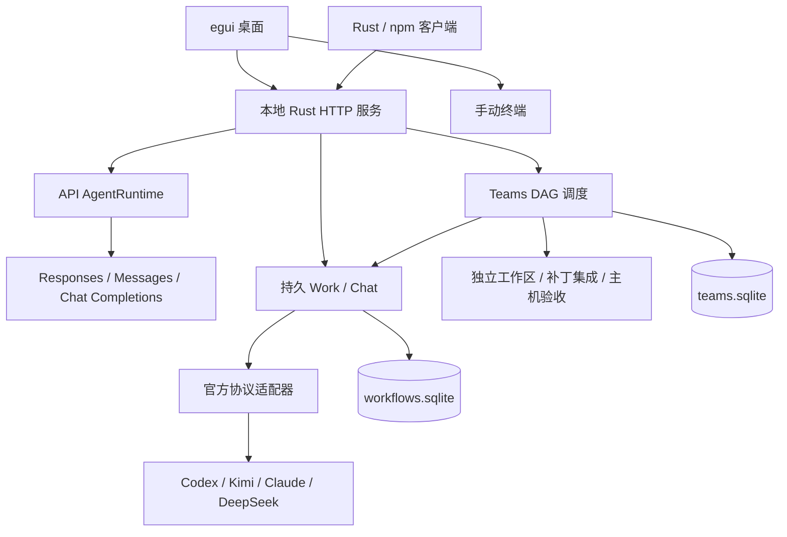

# Wonderland 开发者交接指南

交接日期：2026-09-21。适用源码：0.11.0 系列；本次整理前的功能基线为 `6383c9a01df9612dce66dcd957f45b7634649a23`。仓库：[Alice-Marx/Rust_for_AI-agent](https://github.com/Alice-Marx/Rust_for_AI-agent)。**本次发布是否完成、最终提交、产物哈希、npm 标签和本轮测试结果，以 [RELEASE-0.11.0.md](RELEASE-0.11.0.md) 和 [交付报告](DELIVERY-0.11.0.md)为准。**本文件不把准备发布等同于已经发布。

本指南面向没有参与此前对话的开发者。它说明如何运行现有系统、如何避免破坏数据与执行约束，以及接下来应在哪里继续编写。逐文件用途见 [文件职责目录](FILE_CATALOG-2026-09-21.md)，历史完成步骤和证据见 [项目进度报告](PROJECT_PROGRESS-2026-09-21.md)。后两份文档按其注明的代码基线阅读；其中的发布状态是当时快照。

## 1. 产品目标与当前交付边界

用户的目标是一个 Rust 桌面多模型工作台：复杂任务由系统拆解，按质量、价格和账号条件分配给不同模型，**每个模型通过自己的官方工具完成执行**；用户也可指定一个官方工具完成整个任务。模型选择时重新读取 LiveBench 官方数据和当前官方价格，不能依赖写死的“模型排名”或把订阅当作无限免费调用。主项目应独立维护适配器，尽量不修改上游工具，方便跟随官方升级。

现有代码已经交付：API Agent、Rust egui 桌面、Rust/npm CLI、官方工具 Work/Chat、Teams DAG、独立 Git 工作区、持久事件、权限与问题交互、验收检查、LiveBench/价格来源快照，以及 Windows 打包流程。

**尚未交付的核心目标：真正按最新质量和成本自动选模、可执行的 USD 硬预算、真实跨厂商协作验收、与官方客户端等效或节省成本的实验证据。**当前 `Automatic` 刷新榜单和价格后仍会阻塞；固定/指定团队一旦设置 `budget_usd` 也会阻塞。不要为了演示流畅直接移除这些检查。

UI 已有 Work/Chat、任务列表/看板、Teams、应用、项目文件/Git、终端和设置；插件平台、定时任务、远程控制、PR、网站等专用产品流程还未完成。“某个项目已收入 `anytool/`”不代表已能受管调度。

## 2. 首次接手建议顺序

1. 阅读本文第 3、6、8 节，先分清三条执行路径、配置合同和任务状态。
2. 获取源码并记下提交、Rust/npm 版本、操作系统、上游 CLI 版本。不要先更新所有依赖或官方 CLI；已有适配存在明确版本边界。
3. 按第 4 节建立**独立数据目录和端口**，以 `AGENT_PROVIDER=offline` 启动后端；检查健康、应用目录和桌面。
4. 运行本地回归，先复现无账号的协议/迁移测试。外部条件测试按需要逐个运行，不要把全部 ignored 测试一键视为免费测试。
5. 用独立示例 Git 项目完成一个固定官方执行器任务，再按第 9 节核对真实测试证据。初始化成功不算真实模型执行成功。
6. 从第 11 节选择一个可独立评审的任务，建立分支、明确验收，再改代码；每个功能 PR 同步更新限制和验证记录。

接手环境能够离线启动、测试命令可复现、真实账号和源码互不混入、开发者能够解释 `Automatic` 为何阻塞，才算完成基础接手。

## 3. 架构：必须保持三条执行路径的语义

| 路径 | 调用链和代码入口 | 适用边界 |
| --- | --- | --- |
| API 对话 | `main.rs` → `api.rs` → `agent.rs` → `provider.rs` / `router.rs` / `responses.rs` / `anthropic.rs` → `tools/` | 模型循环由 Wonderland 自己实现；直连 API 或 CLIProxyAPI 订阅代理均属于此路径，不保证执行的是官方 harness |
| 受管 Work / Chat / Teams | `workbench_service.rs` / `team_service.rs` → `native_executor.rs` / `native_executor/` → 官方 CLI | 模型循环由官方工具实现；主程序负责持久配置、权限、生命周期、隔离工作区和验收，不静默回退到通用 API |
| 手动终端 | `desktop_bridge.rs` + `desktop_terminal.rs`，桌面 `workbench.rs` | 直接启动原工具或自定义可执行程序；原工具负责自己的交互、模型路由和登录，不能凭终端输出保证账单或任务验收 |



桌面主入口是 `src/bin/wonderland-desktop.rs`，`src/bin/desktop/studio.rs` 负责 Work/Chat 等工作台交互，`teams.rs` 负责团队界面，`workbench.rs` 负责文件/Git/终端等。桌面不是团队任务生命周期的所有者；HTTP 服务拥有受管进程。不要把任务调度迁回 UI 绘制循环。

`workflow.rs` 和 `team_store.rs` 是权威业务存储，`session_index.rs` 是可重建的 API 会话检索索引，两者不能用同一套“删除数据库重新生成”策略处理。

## 4. 构建、启动与最小冒烟

### 4.1 通用依赖与获取源码

需要 Git、Rust stable、对应平台的 C/C++ 链接工具链。npm 客户端要求 Node.js 18+；CI 使用 Node.js 22 和 Python 3.13。原生官方工具、Python/Node SandboxRun 解释器单独安装，不由主项目 Cargo 编译提供。Windows 构建发布器还需要 Inno Setup 6/7。

```powershell
git clone https://github.com/Alice-Marx/Rust_for_AI-agent.git
Set-Location Rust_for_AI-agent
git status --short --branch
git rev-parse HEAD
cargo fmt --all --check
cargo test --locked --all-targets --features ui-snapshots
npm test --prefix packaging/npm/wonderland-cli
cargo build --locked --bins
```

如果 `git clone` 在 `github.com:443` 连接超时，但网络仍可访问 GitHub 的 `codeload.github.com`，可使用仓库内的 Git-first 获取脚本：

```powershell
.\tools\Get-UpstreamSource.ps1 -Destination F:\work\Rust_for_AI-agent
```

脚本先尝试浅克隆；失败时从官方 codeload 以完整、不可变提交 SHA 下载源码，并在目标目录写入 `.wonderland-source.json`，记录来源 URL、提交 SHA 与归档 SHA-256。默认 pin 为本交接基线 `24dbf549450c78681db231d9b5e6870f67202b41`；获取其他版本时必须显式传入完整 40 位 `-Commit`，不要以分支名替代。归档回退是可构建的源码副本，不含 Git 历史，不能用于 rebase、push 或依赖提交历史的工作；网络恢复后应重新普通克隆，再移植本地修改。

主程序编译不依赖递归获取全部上游。只有研究或更新特定适配器时，才获取对应子模块，例如：

```powershell
git submodule update --init --recursive anytool/ChatGPT/codex
```

Windows 可使用 MSVC Build Tools 或已配置的 GNU/MinGW；不要混用不匹配的构建缓存。Linux 桌面构建依赖以 `.github/workflows/ci.yml` 为准，目前安装 `pkg-config libxkbcommon-dev libwayland-dev libx11-dev libxi-dev libgl1-mesa-dev`。Linux 文件选择器运行还需要 D-Bus 和桌面 portal；Linux PTY 清理使用 pidfd，需支持它的内核。macOS 编译验证不等于已提供 macOS 安装器。

### 4.2 当前开发机的环境

当前仓库位于 `E:/harness/codex/Rust_for_AI-agent`。本机现有 Rust 环境脚本与外部 target 路径如下；其他机器应使用自己的正常 Rust 安装，不能要求相同盘符：

```powershell
Set-Location E:/harness/codex/Rust_for_AI-agent
. E:/harness/toolchains/enter-rust.ps1
$env:CARGO_TARGET_DIR = 'E:/harness/toolchains/wonderland-target'
cargo --version
rustc --version
```

本机 GitHub CLI 路径为 `E:/harness/toolchains/gh/bin/gh.exe`。此前网络访问有使用本机代理的记录，但代理端口不是项目要求，不应硬编码进程序或新开发者配置。

### 4.3 独立开发后端

下例使用临时目录下的独立数据和 18080 端口，避免与已安装的 8080 服务共用数据库。第一次运行应确保该开发数据目录没有以前保存的连接设置，因为**保存的连接设置优先于 `AGENT_PROVIDER` 环境变量**。

```powershell
$env:AGENT_DATA_DIR = Join-Path $env:TEMP 'wonderland-dev-011-data'
$env:AGENT_ADDR = '127.0.0.1:18080'
$env:AGENT_SERVER_URL = 'http://127.0.0.1:18080'
$env:AGENT_PROVIDER = 'offline'
cargo run --locked --bin wonderland
```

`offline` 只把自有 API provider 设为离线演示；它**不是阻止所有官方 CLI 联网的总开关**。此时创建受管任务草稿不会运行模型，但点击受管任务“启动”仍可能使用官方账号。

新开一个终端，在相同源码目录配置客户端地址：

```powershell
$env:AGENT_SERVER_URL = 'http://127.0.0.1:18080'
cargo run --locked --bin wonderland-cli -- health
cargo run --locked --bin wonderland-cli -- apps
cargo run --locked --bin wonderland-desktop
```

检查点：健康返回正常；应用页显示能力/安装状态；新建草稿、关闭客户端再打开，草稿仍存在；客户端断开不应自动终止已交给服务的任务。安装版、源码版的可执行路径和 `AGENT_SERVER_URL` 必须分清，不能只凭窗口标题认定连接了新版后端。

### 4.4 无全局安装的 npm 客户端

```powershell
$env:AGENT_SERVER_URL = 'http://127.0.0.1:18080'
node packaging/npm/wonderland-cli/bin/wonderland.js --version
node packaging/npm/wonderland-cli/bin/wonderland.js health
node packaging/npm/wonderland-cli/bin/wonderland.js apps
```

npm 包是客户端，不附带 Rust 后端或官方模型工具。npm 的 `wonderland` 命令别名与原生后端 `wonderland.exe` 同名，排错时优先使用明确路径或 `wonderland-cli`，并查看 `Get-Command wonderland-cli -All`。发布渠道需用 `npm view rust-ai-wonderland-cli dist-tags --json` 核验，不把 `latest` 与 `next` 当作同一版本。

## 5. 数据目录、迁移、备份与回滚

### 5.1 应当保存的内容

| 内容 | 含义及处置 |
| --- | --- |
| `AGENT_DATA_DIR` | 源码默认 `.agent-data`；Windows 安装启动器默认 `%LOCALAPPDATA%/WonderlandData`。独立开发建议放到仓库外 |
| `workflows.sqlite` | 官方 Work/Chat、项目记录、配置与事件的权威数据库；不能当作缓存删除 |
| `teams.sqlite` | 团队、节点、attempt、预算预留和验收等权威状态 |
| `workbench.lock` | 后端独占锁；遇到占用先找原服务，不通过强删锁文件绕开并发所有权 |
| `team-workspaces/` | 团队和 attempt 的独立 Git 工作区及产物；清理前先检查任务终态与成果保存 |
| `sessions/*.json` | 自有 API 会话原始记录 |
| `sessions-index.sqlite` | 可从 API 会话重建的 FTS 索引；它与 workflow/team 数据库性质不同 |
| `model-intelligence/`、`pricing/` | 榜单/报价来源、固定 SHA、散列与时间记录；保留以支持审计 |
| 连接/凭据、CLIProxyAPI 配置与 `auth` | 用户私密状态；不放 Git、日志、安装包或 npm；迁移到别的用户/机器时可能必须重新登录 |

官方 CLI 还有自己的登录与配置目录，它们不会因为复制 `AGENT_DATA_DIR` 就自动完整迁移。Windows DPAPI 与当前用户绑定；不能承诺把加密文件复制给另一个开发者后仍可解密。交接源码不需要交接个人凭据。

### 5.2 v1 → v2 的精确变化

0.11.0 的 `workflow.rs` 在 SQLite 事务内新增 `reasoning_effort TEXT`，并将 `PRAGMA user_version` 从 v1 更新为 v2。旧记录保持 `NULL`，不从旧事件推测档位；旧模型、输出、状态和历史保持。新草稿的选择持久化到记录，启动仅使用记录值。

旧 0.10.0 程序拒绝读取 v2。**降级二进制不是数据库回滚**，没有自动降级迁移。不要手动改 `user_version`、删除字段或把 v2 宣称为 v1；这样会绕开保护并失去正确性保证。

### 5.3 升级前备份

1. 记录服务可执行路径、版本、当前数据根和任务状态；结束或明确停止运行中的任务，关闭桌面并让对应后端正常退出。
2. 确认没有其他后端仍持有该数据根；数据库 WAL 模式下不要在运行时仅复制一个 `.sqlite` 文件。
3. 备份**整个数据根**到独立目录，保留所有文件。若不能停机，应另行实现和验证 SQLite 一致性备份，不把普通文件复制当作在线备份。
4. 用备份副本在独立端口测试新版，确认旧任务数量、ID、模型、状态、输出及事件，之后再升级日常使用目录。

仅在完成停机检查后，可执行此备份示例；实际源目录如有覆盖应修改为真实 `AGENT_DATA_DIR`：

```powershell
$wonderlandDataSource = Join-Path $env:LOCALAPPDATA 'WonderlandData'
$wonderlandBackupRoot = Join-Path $env:LOCALAPPDATA 'WonderlandBackups'
$wonderlandBackupPath = Join-Path $wonderlandBackupRoot ('before-011-' + (Get-Date -Format 'yyyyMMdd-HHmmss'))
New-Item -ItemType Directory -Path $wonderlandBackupRoot -Force | Out-Null
Copy-Item -LiteralPath $wonderlandDataSource -Destination $wonderlandBackupPath -Recurse
Get-Item -LiteralPath $wonderlandBackupPath
```

回滚时保留升级后的数据目录，停止新版服务；将升级前完整备份复制到一个新的恢复目录，指定旧版 `AGENT_DATA_DIR` 指向恢复目录再启动。不要覆盖唯一备份。升级后新产生的任务不会出现在旧备份里；团队 worktree 依赖其源 Git 仓库及绝对路径，恢复时也需要检查这些路径。恢复数据库不能恢复已经结束的原生进程。

## 6. HTTP、Rust CLI 和 npm CLI 的合同

### 6.1 两组 HTTP 路径

| 路径 | 用途 |
| --- | --- |
| `/v1/agent/stream`、`/v1/agent/run` | 自有 API Agent；SSE 和非流式请求 |
| `/v1/sessions`、`/v1/sessions/search` | API 会话与派生检索 |
| `/v1/connection`、`/v1/providers/cliproxyapi/*` | API/订阅代理连接与管理 |
| `/api/v1/apps`、`/api/v1/apps/{id}/probe` | 受管适配器能力、实际安装探测 |
| `/api/v1/workflows`、`/{id}`、`/{id}/events` | 持久官方任务 |
| `/api/v1/workflows/{id}/start` | 启动已保存草稿；空请求体或 `{}`，拒绝执行配置覆盖 |
| `/api/v1/workflows/{id}/approve`、`/answer`、`/cancel`、`/accept` | 一次性权限/提问、取消、验收；不要与 API Agent 的 permissions 路由混用 |
| `/api/v1/teams` 及其子路由 | 团队计划、启动、事件与取消；Automatic 团队可用 `POST /api/v1/teams/{id}/routing/preview` 显式提交约束预览，用 `POST /api/v1/teams/{id}/routing/preview/saved` 按 Team 保存的 `routing_policy` 预览，用 `GET /api/v1/teams/{id}/routing/preview` 重放最近一次决策 |
| `/api/v1/intelligence`、`/refresh` | LiveBench 证据状态/在线刷新 |
| `/api/v1/pricing`、`/refresh`、`/quote` | 价格状态、在线刷新、精确报价；路由定义在 `team_service.rs`，数据与解析在 `pricing.rs` |

路由预览约束接收显式 LiveBench 类别、可选类别权重、精确计费渠道和 token 估算；创建 Team 时可把同一对象放入可选的 `routing_policy`，候选绑定仍从已保存的 Automatic 团队读取。在线预览会在同一轮刷新榜单与价格并加载内嵌身份注册表，返回 `routing-v2` 决策、候选排除原因、质量分、估算成本、`benchmark_snapshot_id:price_snapshot_id` epoch 与 `identity_mapping_version`，并将完整决策（其中包含约束）写入 `routing_preview` 事件。`/saved` 会读取 Team 配置后重新核验在线证据；无请求体的 GET 只读取最新事件，不刷新网络，也不代表新的派工授权。它不会启动模型，也不会解除 Automatic 当前的正式阻塞；订阅、代理、缺失榜单行、歧义价格阶梯和未解决价格条件仍会被排除。

工作流创建的示意 JSON；`cwd` 必须改成服务机器上实际存在的绝对目录，model 必须是账号支持的精确 ID：

```json
{
  "title": "检查错误处理",
  "prompt": "只读检查错误处理，列出可以验证的问题",
  "cwd": "E:/projects/demo",
  "mode": "chat",
  "app_id": "claude",
  "model": "claude-sonnet-4-6",
  "reasoning_effort": "high",
  "read_only": true,
  "max_duration_secs": 600,
  "acceptance": ["人工核对结论与原文件"]
}
```

这是格式示例，不保证该账号可调用示例模型。服务会强制 `mode=chat` 为只读。`reasoning_effort` 省略/`null` 表示沿用官方默认；不能用字符串 `"default"` 代替，也不能把 `off`、`none` 和 `minimal` 相互翻译。

### 6.2 两个 CLI 并非所有语法一致

以下 `wonderland-cli` 左列指 Rust 原生客户端，右列指 npm 客户端；测试时可用 `cargo run --bin wonderland-cli -- ...` 或 `node packaging/npm/wonderland-cli/bin/wonderland.js ...` 明确区分。

| 操作 | Rust CLI | npm CLI |
| --- | --- | --- |
| 创建草稿 | `--cwd <dir> --model <model> work create "任务" --app kimi-cli` | `--cwd <dir> --model <model> work create kimi-cli "任务"` |
| 创建只读官方 Chat | `work create "任务" --app <app> --chat`，同时带全局 cwd/model | 没有等价的 `--chat` 创建参数；`--mode plan` 只创建只读 Work；完整 Chat 可走桌面或 HTTP |
| 单任务推理档位 | 在 `work create` 前传全局 `--reasoning high` | 同样只在 `work create` 使用 `--reasoning high` |
| 创建并立即启动 | Rust create 支持 `--start`；默认仅建草稿 | 先 create，再 `work start <id>` |
| 批准一次请求 | `work approve <id> <request-id> --allow`；不带 `--allow` 为拒绝 | `work approve <id> <request-id> allow` 或 `deny` |
| 查看工作流增量事件 | `work events <id> --after <seq>` | 当前 `work events <id>`；需要游标时直接用 HTTP 或 Rust CLI，不能照搬 Teams 参数 |
| 刷新 LiveBench | `intelligence --refresh` | `intelligence refresh` |
| 创建/启动 Teams | `team create --file team.json`，再 `team start <id>` | 相同 |
| Teams 事件游标 | `team events <id> --after <seq>` | 相同 |
| 精确价格查询 | `pricing quote --app <app> --model <id> --billing api` | 相同 |
| API 对话 | 全局参数在 `chat` / `run` 前 | `chat` / `run` 同样走自有 API 路径，不是官方 Work/Chat |

Rust 的全局模型/目录/推理参数放在子命令前最明确。持久任务启动禁止改档位；即便设置来自环境变量 `AGENT_REASONING_EFFORT`，对 `work start` 等操作也会被客户端拒绝。若先设置环境变量创建草稿，后续启动应清除该默认或使用未设该变量的终端；执行配置已在草稿内保存。

客户端 UI 应读取**所连接后端**的 `native_controls` 和 `workflow_settings.reasoning_effort_at_create`，不要用桌面自身版本推断远端支持度，也不要在能力获取失败时显示所有档位。当前通用档位清单说明适配器能表达的值，不是某模型实际接受的值；详情显示“请求推理档位”，不能冒充已核验的实际生效值。

## 7. 官方工具、账户与安装身份

| app_id | 受管协议 / 已有版本证据 | 账号与运行前提 |
| --- | --- | --- |
| `codex` | 官方 `app-server` / stdio；本地身份和握手校验 | 使用官方 Codex 登录/配置；显式 OpenAI provider 与精确模型，适配器限制子代理等旁路；不能用代理 API 登录状态推断原生登录 |
| `kimi-cli` | Python 官方 Wire；真实任务验证过 `kimi-cli==1.50.0` | Kimi 官方登录和配置；可通过 `KIMI_SHARE_DIR` 指定原生配置根；精确模型必须解析到允许的官方提供商，不接受 Node Kimi 冒充 |
| `claude` | 官方 npm `@anthropic-ai/claude-code` 的原生入口，严格验证 `2.1.193`，双向 stream-json | 官方 OAuth/Anthropic API；保留允许的认证环境如 `ANTHROPIC_API_KEY`、`CLAUDE_CODE_OAUTH_TOKEN`、`CLAUDE_CONFIG_DIR`，不在交接材料中填写实际值；拒绝非 first-party、错误有效设置与不受支持版本 |
| `deepseek` | 官方 npm `@deepseek-ai/dsh@0.1.6-alpha.2`，ACP | Node 和 dsh；服务启动环境中的 `DEEPSEEK_API_KEY`；可设 `WONDERLAND_DSH_CLI` 为官方 `lib/bin.js` 的绝对路径，不宣称订阅 OAuth |

实际安装探测通过 `apps --probe <app_id>`。它不调用模型；程序路径、版本、包元数据、SHA-256 是本地身份记录，不是发行商数字签名或远程模型证明。Codex/Kimi 的识别规则与 Claude/DeepSeek 的严格发行校验不同，不要泛称所有工具都按同样方式锁定版本。当前 `resume` / `fork` 能力均为 false。

受管能力当前允许表达：Codex `none/minimal/low/medium/high/xhigh/max/ultra`，Claude `low/medium/high/xhigh/max`，DeepSeek `off/low/high/max`；Kimi 没有通用 `reasoning_effort` 选项。必须继续校验具体工具/模型的实际支持，不能直接用该数组作为“账号可用模型能力”。

受管适配为保持模型、权限和只读保证，会限制原生工具的插件、MCP、自定义设置或子代理。比如 Kimi 会拒绝存在可能绕过路由的插件，Claude 验证有效安全设置，DeepSeek 使用隔离 profile。用户想保留原工具完整自定义交互时使用手动终端；不能为兼容任意插件而静默减弱受管保证。

CLIProxyAPI 当前按原版 7.3.7 sidecar 集成，相关环境名包括 `CLIPROXYAPI_BIN`、`CLIPROXYAPI_DATA_DIR`、`CLIPROXYAPI_PORT`、`CLIPROXYAPI_BASE_URL`、`CLIPROXYAPI_API_KEY`。它用于 API 路径，原生官方工具各自的登录是另一套状态。代码内配额/轮换代理能力不代表已经建立统一订阅计费系统。

## 8. 任务状态、并发、取消与 Teams 约束

### 8.1 单任务状态

| 状态 | 含义 / 接手时的操作 |
| --- | --- |
| `draft` | 已持久化但未调用模型；服务只允许从草稿开始一次执行 |
| `running` | 服务拥有的官方进程正在执行 |
| `waiting_input` | 等待一次性批准或问题答复；必须对应准确 request_id，不能自动全局放行 |
| `verifying` | 工具执行已结束，结果尚未验收；不等于成功 |
| `succeeded` | 单任务已有验收说明，或 Teams 完成独立验证；仍需阅读证据的实际范围 |
| `failed` | 执行/协议/检查失败；保留输出和原因，新建任务重试 |
| `cancelled` | 取消后的终态；发出取消请求后仍应等服务确认终态与进程清理 |
| `blocked` | 条件不满足，需查看事件/错误；不要通过改数据库状态强行启动 |
| `interrupted` | 服务重启后发现未结束任务；没有原生恢复保证，不自动重放编辑 |

`workflow.rs` 的低层状态机可能允许比公开服务更多的迁移；对外行为以 `WorkbenchService::start_stored` 为准，目前仅允许 `draft` 启动。手工修改状态或直接调用存储层，可能绕开进程所有权和重复执行防线。

同一或重叠目录的写任务受排他检查；只有互不冲突的独立工作区或均只读的任务可并行。服务持有数据根独占锁。关闭桌面不等于关闭服务；服务重启把未完成任务标为中断，而非重新执行。

单任务的 `accept` 接受人工证据，不自动运行一整套工程测试。Teams 子任务受父任务拥有，不能从普通 start/accept 接口绕开父团队启动或验收；其 app/model/effort 必须与保存的父绑定完全一致。

### 8.2 Teams 合同

- 输入必须是干净的 Git 仓库根；不自动吞并未提交改动。先在独立示例项目开发测试流程，不直接拿日常主项目做第一轮真实试验。
- `fixed` 使用固定规划器/执行器；`assigned` 要有显式节点和绑定及候选清单；`automatic` 当前刷新来源后仍阻塞。
- `nodes: []` 允许官方工具生成 JSON DAG；节点包含目标、依赖、写入路径、验收条件和可选执行器。无效 DAG、重复 ID、越界写入不能靠自然语言解释放行。
- 默认并发 2、每节点最多 2 次尝试；上限为 8 并发、24 节点、每节点 5 次尝试。重试仍是原固定执行器的新隔离 attempt，不隐式换供应商。
- 每次运行及实现 attempt 使用独立 Git worktree，保护源 checkout 和已有测试。worktree 是改动/集成隔离，不是操作系统沙箱。
- 补丁经范围、散列、篡改和冲突检查后串行集成；只读评审返回结构化 `accepted/findings/summary`；全部主机检查通过且被测 revision 未漂移才确认团队成功。
- `checks` 使用明确 `program` 和 `args`，在主机运行；它不是 Bash 字符串，也不是 SandboxRun。检查命令要由用户/项目合同明确声明，不允许工作节点随意换成更容易通过的命令。
- 事件游标为递增 `seq`。断线重连从已确认游标续读，并避免重复展示；看到流 EOF 或进程 exit 0 均不足以判断最终成功。
- 成功成果位于记录的集成工作区及被测 revision，原 checkout 保持不变；创建 PR、合并或覆盖用户工作区是后续明确步骤，不能把团队成功描述成已经上传用户代码。

`budget_usd=null` 才能使用当前固定/指定受管执行流程。`team_store.rs` 虽有整数微美元预留/结算与并发账本测试，仍没有和原生账号实际消费闭环；不能据此承诺硬预算。

## 9. 验证证据与继续测试的标准

本次发布新增运行的结果以发布/交接结果记录为准。此前 `6383c9a` 基线的证据如下，不能误写成每次构建都重新执行过真实账号测试：

| 范围 | 已有证据 | 实际边界 |
| --- | --- | --- |
| Windows Rust 回归 | 404 库 + 3 Rust CLI + 18 桌面 + 7 协议集成，共 432 项通过；7 项外部条件默认忽略 | 多数为本地逻辑/模拟协议，不等同真实模型全覆盖 |
| npm | 14 项测试通过 | 测试服务验证路由、参数、流与错误传播 |
| Linux/macOS | 编译和指定模块套件 | 不是三平台完全相同的全量执行，也不是 Unix 安装器验收 |
| SQLite v1 → v2 | 真正旧库副本迁移/重启；5 个成功任务保持；新草稿 effort 保持；非法覆盖拒绝 | 未调用模型、未改原始数据库；详见进度报告与当前验证文档 |
| Kimi 官方订阅 Teams | 独立 JS 项目：规划、两个实现节点、只读评审、12 项 `node --test` 通过 | 同一 Kimi 模型的多任务协作，不是双厂商协作 |
| Codex | 官方握手/协议验证，已有真实调用失败记录 | 尚无成功的完整 Codex 团队实测；请求 effort 不等于完整有效值回读 |
| Claude | 官方 2.1.193 初始化，以及本机合成 Anthropic SSE 的完整 turn | 不连接真实 Claude 推理服务，不能称真实 Claude 质量测试 |
| DeepSeek | 官方 0.1.6-alpha.2 无密钥 ACP 初始化、建会话、模型/effort 设置及关闭 | 尚无真实推理；ACP committed block 不是逐 token；上下文占用不是计费 token |
| LiveBench/价格 | 两官方仓库来源、固定 SHA 与时间；有限官方报价解析 | 来源成功不等于 benchmark 绑定、账号计费和自动派工已完成 |

建议针对修改选择有意义的测试，再按发布要求运行全量。常用模块测试入口如下；这是接手者执行说明，不表示本指南编写时重新运行了它们：

```powershell
cargo test --locked --lib workflow::tests
cargo test --locked --lib workbench_service::tests
cargo test --locked --lib team_
cargo test --locked --lib native_executor
cargo test --locked --lib app_diagnostics
cargo test --locked --lib desktop_
cargo test --locked --test protocol_regressions
npm test --prefix packaging/npm/wonderland-cli
```

正式发布前运行 Windows 全目标和格式检查，查看 CI 的 Unix 项。GUI 变更可启用 `ui-snapshots` 做常规/940×620 渲染检查，但发布构建不要启用该特性。对窗口能绘制、按钮能点击的验证与对真实模型完成任务的验证应分别记录。

真实模型试验要记录：源码提交、官方工具精确版本和入口摘要、提供商/模型/请求与有效档位、账户渠道、任务合同、源 Git revision、worktree、事件、审批次数、最终被测 revision、测试输出、耗时与实际可取得的费用。日志必须去除认证信息；模型“声称完成”不能代替主机测试。只有 Kimi 的既有账号实测有明确记录，其他提供商需要使用交接后开发环境中已获授权的账户。

## 10. 不能误当作已实现产品能力的旧模块

| 模块 | 实际作用 | 不应拿来替代 |
| --- | --- | --- |
| `planning.rs` | 自有 Agent 的启发式分句、有限步骤和简单反思 | 真实官方工具 Teams DAG 规划与自动质量优化 |
| `collaboration.rs` | worker 目录与 Research/Expense/Echo 等基础示例 | 多厂商原生协作引擎 |
| `evaluation.rs` | 启发式分数和记录 | 校准过的质量模型、真实评测与论文结果 |
| `expenses.rs` | seeded 费用 CRUD 示例 | 模型 token 计费、订阅额度或预算总账 |
| `router.rs` | API 网络协议选择/部分回退 | 成本/质量模型路由，或官方执行器失败后的通用 API 回退 |
| `tools/background.rs` | 后台命令的启动、查看和终止 | 定时调度/cron 服务 |
| `skills.rs` | Markdown 技能/提示材料读取 | 带签名、权限、安装与更新的插件平台 |
| `sandbox.rs` | 专用 Python/Node SandboxRun | 整个桌面、Bash、MCP、hooks 和所有官方 CLI 的统一安全隔离 |
| `anytool/` | 16 个上游子模块与 Claude 快照来源 | 所有上游均已受管接入、所有原生 GUI 都可嵌入 |

`model_intelligence.rs` 与 `pricing.rs` 分别管理榜单和价格，旧状态对象的占位价格字段不应作为已核验报价源。新增统一视图时要消除含混的双重状态，不要复制一份过期价格给自动路由。

## 11. 下一阶段按文件分工的实施任务

以下是建议的依赖顺序，均为待办，不是已完成承诺。H01/H02 可由两人并行，H03 依赖二者；H04 与 H03 共同决定何时能向用户开放成本控制。GUI 产品工作可以并行，但不得用前端状态掩盖后端阻塞。

### H01：受管执行器的身份与真实模型闭环

**位置：** `src/native_executor.rs`、`src/native_executor/claude.rs`、`src/native_executor/deepseek.rs`、`src/app_diagnostics.rs`、相关协议测试和适配文档。

1. 将工具版本、精确模型、提供商、请求/有效推理档位、账号渠道及证据时间整理成可返回的能力记录；不凭字符串前缀完成全部身份核验。
2. 补 Codex 生效配置回读及真实完整任务；为 Claude、DeepSeek 补真实推理、权限、取消与失败验收。
3. 以独立示例 Git 项目，用至少两个厂商分别完成不同节点，主机测试并确认源 checkout 不变。
4. 保存脱敏协议 fixture，新增版本时先通过对照再扩大支持，不修改上游绕过身份保护。

**验收门槛：** 错提供商/错模型/错有效 effort 在提交任务前或被发现时明确失败；无静默 API 回退；每个实测都有版本、任务、产物和测试证据；两厂商共同任务通过独立验收。

### H02：实时榜单、精确报价、账号额度的共同数据合同

**位置：** `src/model_intelligence.rs`、`src/pricing.rs`、`src/model_profile.rs`、`src/native_executor.rs`；必要时新增独立账号能力模块。

1. 建立精确模型 + 修订/日期 + 推理配置与 LiveBench 条目的映射，并给缺失模型显式 unknown 状态；不能仅因显示名称相近就用同一分数。
2. 扩展目标官方价格来源解析，保留渠道、币种/单位、缓存档位、上下文/时间条件、原文来源、抓取时间与散列；格式变化不能落成零价。
3. 明确定义 API 实付和订阅剩余额度、限速/重置周期及机会成本；没有可核验来源时继续 unknown，不把包月除以任意 token 数当作真实单价。
4. 一次 routing epoch 引用同一批不可变数据；刷新失败保留历史展示和原时间，但拒绝把旧快照视为本轮已更新。

已交付：`src/model_identity.rs` 注册表把精确 (app_id, model, reasoning_effort) 解析到 LiveBench 条目或显式 unknown（v1.1 种子含 Kimi 两条与 DeepSeek 一条 attestation：kimi-k2.7-code、kimi-k3、deepseek-v4-pro；2026-09-23 核验确认全部 37 个 OpenAI 报价模型与 14 个 Anthropic 报价模型在 2026-06-25 榜单均只有档位变体行、无 byte-identical 行，故不映射）。`src/pricing.rs` 现为五个官方源：Anthropic 定价经同 epoch 的官方 models overview join 到 attestation 的精确 API model ID/alias，退役/受限/派生路径与缓存乘数不变量显式化；DeepSeek 产出峰/谷两档（逐字 UTC 窗口条件）并按官方脚注为退役别名出报价。`parser_version=2`。真实在线刷新五源全部 verified（59 条报价）；细节见 [价格解析工作报告](WORK-REPORT-2026-09-22-PRICE-PARSERS.md)。第 3 项已交付**数据合同**：`src/account_billing.rs` 定义每个受管应用各计费渠道的语义（api=USD/token 列价且列价≠实付；订阅=提供商额度单位、永不折算 token 单价），账号级字段（实付/剩余额度/限速/重置周期）在集成官方来源前一律显式 unknown 并带原因，`dispatch_blockers()` 给出 Automatic 解锁清单，经 `/api/v1/pricing` 状态的 `billing_channels` 与 `dispatch_readiness` 暴露。数值集成（真实账单/额度端点）仍待做，`auto_dispatch_ready` 保持 false；细节见 [账号计费合同工作报告](WORK-REPORT-2026-09-23-ACCOUNT-BILLING.md)。

**验收门槛：** 过期、缺失、歧义、解析失败、缓存写入价未知、时段不符等均可重现阻塞；所有用于派工的字段可追溯官方证据；订阅与 API 的成本语义不混淆。

### H03：真正开启 Automatic 调度

**位置：** `src/team_service.rs`、`src/team_store.rs`、H02 的数据层；新增单独的路由策略模块比继续扩大 `team_service.rs` 更便于测试。

已交付：`src/routing.rs` 决策内核（`routing-v2`）+ 预览/保存/重放三接口；**启动路径已接通**——Automatic 团队启动时走完整决策链（在线刷新、身份注册表、routing-v2 决策、`routing_decision`/`binding_applied` 事件、`team_store::set_planner` 把选中绑定写回为 planner/默认节点执行器），决策 selected 且无 `budget_usd` 即进入既有执行路径（与固定执行同等成本地位），决策 blocked 或刷新失败保持 Blocked 并携带候选级原因；带硬预算的派工仍等 H04。真实跨厂商实例与账号核验仍待做。本轮先期内容：它完成显式任务类别权重、精确榜单行/价格报价匹配、质量门槛、已知 token 成本预算过滤、确定性排序、候选排除理由和证据事件持久化；v2 起每个候选的榜单行必须由内嵌 `src/model_identity.rs` 注册表对该精确 (app, model, reasoning_effort) 元组 attestation，未映射、核验不在榜、attestation 条目不在当前快照、或调用方声明的榜单行与 attestation 不一致都会拒绝该候选，决策携带 `identity_mapping_version` 作为证据链。正式 Automatic 派工、账号/订阅身份核验和决策后原子预占仍未开启。

1. 先定义每个节点所需能力、质量最低条件、候选模型/工具绑定及约束，不直接从总体榜单分数等同推断任务质量。
2. 在每次开始计算模型权重时在线刷新两类来源，记录 `routing_epoch`、候选排除理由、评分输入和决策输出。
3. 基于已经核验的身份、价格/额度与质量信息选择绑定，再持久化后启动；重试/升级/重规划要有显式新决策事件与预算影响。
4. 建立可解释的确定性测试、数据刷新失败测试、并发调度一致性测试；先在独立项目试运行并对比固定策略。

**验收门槛：** 可从保存的证据重现分配结果；每个节点仍使用该模型自己的官方工具；未知条件阻塞；有真实跨厂商成功实例。仅把当前 `Blocked` 改成 `Running` 不算完成。

### H04：预算真正约束原生消费

**位置：** `src/team_store.rs`、`src/team_service.rs`、原生 usage 事件、`src/pricing.rs`。

**已交付（观察归档阶段，H04 未完成）：** `src/team_service.rs` 在 Planner 与每个 node attempt child 进入验证或终止时，将其原生 usage 事件按 workflow/phase/node/attempt 归入 `usage_observed`。CLI/harness 自报 USD 明确标为未确认，估算与 provider 确认金额保持空值，不对快照求和。此记录不是账单，也不限制在途消费；`budget_usd` 仍在派工前阻塞。实施细节与测试见 [H04 usage 工作报告](WORK-REPORT-2026-09-23-H04-USAGE.md)。

1. 定义规划、执行、评审、重试、缓存和并发在途请求的费用归属，明确什么是估算、什么是提供商确认值。
2. 派工前预留，终态结算/释放，异常和重启对账；订阅额度用其自身单位管理。
3. 为官方工具设计可验证的输出/轮数限制、提前停止与在途超额策略。若工具无法保证硬 USD 边界，就保持该渠道不支持硬预算，UI 明示可用的软预警。

**验收门槛：** 并发/崩溃不重复预留或漏结算；无免费零价未知项；可解释最坏在途消耗。只有能证明兑现的限制才允许解除当前 `budget_usd` 阻塞。

### H05：恢复、重试、分叉与长任务稳定性

**位置：** `src/workflow.rs`、`src/workbench_service.rs`、`src/team_store.rs`、`src/native_executor*`、`src/process_tree.rs`。

**已交付（新任务副本第一步，H05 未完成）：** 终态独立 workflow 可经 `POST /api/v1/workflows/{id}/duplicate` 或 Rust/npm `wonderland work duplicate <id>` 复制为 Draft；保留提示/工具配置/验收合同，生成新 ID，在事务内记录 `duplicated_from`。原生 session、输出和错误不复制，也不自动启动；Team-owned child 必须由父团队处理。此功能不是恢复、历史分叉或同一 attempt 重试；所有适配器的 `resume/fork` 继续为 false。细节见 [H05 新任务副本工作报告](WORK-REPORT-2026-09-23-H05-NEW-DRAFT.md)。

1. 分开“继续同一原生会话”“复制成新任务”“从失败节点重试”“分叉历史”，分别定义数据和权限合同。
2. 建立保存的原生 session id、工具版本、配置、工作区 revision 与恢复可用性检查；不可恢复时给出新任务流程。
3. 注入服务崩溃、网络断开、待批准中退出、进程残留和集成中取消场景，保证状态、进程和数据库一致。

**验收门槛：** 不重放已经完成的写操作、不复用过期批准、不在另一个工作目录恢复；只有实测支持的适配器才报告 `resume/fork=true`。

### H06：桌面产品完整流程

**位置：** `src/bin/desktop/studio.rs`、`teams.rs`、`workbench.rs`、`ui.rs`、`icons.rs` 和对应后端模块。

优先补统一待处理中心、运行/验收/失败原因导航、成果预览与导出、团队被测 revision 显示，以及“官方任务 / API 对话 / 手动终端”的明确入口。之后分别建设插件、定时任务、远程主机、PR、网站面板，不仅添加不可用的导航按钮。

每个新面板都应有创建、进行中、权限等待、失败、重试/取消、成功产物与空状态；要支持键盘、中文、缩放、小窗口和长期输出。工作区编辑器仍需独立规划 LSP、调试和更多语言支持，不将已有文件识别当作完整 IDE。

**验收门槛：** 从真实项目完成端到端操作；切换项目不串目录；关闭界面不丢服务任务；截图以外还要记录实际操作验证与后端状态。

### H07：插件、定时、远程及 Git/网站集成

**位置：** 先在 `docs/DESKTOP_PRODUCT_PLAN.md` 的合同上细化独立模块，再接 `src/workbench_service.rs` 与桌面；不要塞入 `tools/background.rs`。

建议分别交付：插件 manifest/权限/安装与回滚；调度持久化/时区/重复触发去重/错过执行策略；远程身份/TLS/权限/断线重连；GitHub PR 的授权、diff、创建/更新/结果；网站本地预览与发布目标区分。远程执行不能只把监听地址改成 `0.0.0.0`。

**验收门槛：** 每项都有生命周期和实际后端；定时重启不丢计划或重复派工；远程客户端不能越权；外部写操作留下可审计的明确目标和结果。

### H08：沙箱、MCP 与安全边界

**位置：** `src/sandbox.rs`、`sandbox_windows.rs`、`permissions.rs`、`mcp.rs`、`mcp_sse.rs`、`mcp_oauth.rs`、`process_tree.rs`。

补 Unix 真实隔离与资源限制；明确哪些宿主执行需要新的隔离后端，哪些只依赖官方工具策略。MCP 补资源模板、分页、通知更新及 sampling/elicitation 的授权合同，测试实际 stdio/HTTP/SSE 服务的断线、刷新和撤权。不将所有官方工具 MCP 配置自动互相复制。

**验收门槛：** 文件/网络/进程边界有真实系统测试；无可用隔离时拒绝；OAuth token 不进日志；服务重载不留下孤儿进程或旧授权。

### H09：官方工具升级与更多应用适配

**已评估并推进（2026-09-23，见 [anytool 接入评估](ANYTOOL-ADAPTER-ASSESSMENT-2026-09-23.md)）**：ACP 是 anytool 候选工具的收敛协议。MiMo、Kimi Code、MiniMax Code 与 Grok Build 均已通过独立 dialect 接入；Grok 另扩展了通用 ACP 的可选非交互 authenticate 生命周期，离线验证覆盖身份、模型/档位、权限、x.ai 扩展、usage 与取消，真实官方 1.0.38 安装和账号握手仍待 H01。ZCode 是自有 app-server 协议，下一步先核对 npm 发布物与固定源码提交；opencode Go 主干无结构化入口暂不接。所有新增工具的真实握手/推理与固定发布指纹仍须按 H09 步骤 7–8 验证。

**位置：** `src/desktop_bridge.rs`、`src/app_diagnostics.rs`、`src/native_executor/`、`anytool/`、`REFERENCES.md`。

优先选有稳定结构化协议且允许明确模型/权限控制的官方工具。Kimi Node、MiniMax、MiMo、ZCode 等目前的手动入口需要逐项评估，不能仅复制 Codex 的 JSON 字段后宣称受管适配。厂商无合适协议时保留终端入口，并写明限制。

**验收门槛：** 一个新工具按第 12 节完成身份、配置、审批、取消、事件、计费语义、真实任务和文档，再纳入候选分配。保持主程序适配层可随上游升级，不创建难同步的隐式 fork。

### H10：研究实验与质量/成本结论

**位置：** 新建独立实验样例/数据结构，衔接 `model_intelligence.rs`、`pricing.rs`、Teams 记录；不要直接用旧 `evaluation.rs` 的分数出结论。

准备多语言和不同难度的任务集，对比单官方客户端、固定单模型 Teams、指定多模型、自动策略。保存相同任务/测试、模型版本、工具版本、时间、全部阶段费用和人工介入；重复运行后再报告通过率、返修、延迟和成本分布。用户研究框架中的目标不是已取得的结果。

**验收门槛：** 失败样本保留、测试不被执行器降低、费用包含规划/评审/重试、数据可复核；没有证据时不写“等效官方效率”或“节省 40–60%”。

## 12. 新增或升级适配器的标准步骤

1. **确认来源与许可。** 记录官方仓库、发行渠道、版本/提交、包名、支持平台和协议文档；`anytool/` 的镜像/快照不能替代官方发行身份。
2. **本地只读研究。** 使用官方 CLI 的机器协议、app-server、Wire 或 ACP，了解消息终态、错误、权限和取消；尽量不改上游。
3. **独立适配模块。** 在 Wonderland `native_executor/` 实现协议与版本检查，沿用统一 `NativeRequest/NativeEvent/NativeControl` 及进程生命周期。不要让 UI 直接读写子进程协议。
4. **绑定与生效检查。** 显式模型/提供商/请求 effort、工作目录、只读工具集合；能回读就回读有效值，无法核验的条件保留限制，不伪造 effective 字段。
5. **权限与生命周期。** 一次性批准/拒绝、问题映射、关闭控制通道默认拒绝、取消/超时/EOF/无终态失败、输出和待处理请求有界；保留原有组织策略。
6. **离线回归。** 捕获脱敏协议 fixture，测试乱序/分块/重复、模型漂移、未知控制请求、错误终态、批准后重复使用等；fixture 不能携带 token 或用户私有文件内容。
7. **官方程序检查。** 做版本/初始化/设置检查，记录无推理验证边界；再用授权账户完成独立 Git 示例的真实任务。
8. **产品与发布。** 更新应用能力、UI/Rust/npm/HTTP 合同、文档和许可；不支持 resume/fork/预算时继续显式 false/blocked。通过检查后才更新上游固定提交或受支持版本。

新增适配不能静默降低为普通 API 调用。若需要一种“官方模型 API Agent”入口，应明确归入第 3 节的 API 路径，而非冒充官方工具执行。

## 13. Git 分支、发布与成果交付

### 13.1 仓库组织与提交

`main` 已经包含此前授权合并的功能成果，不需要重新从旧分支搬一遍。接手时先 `git fetch origin`、检查 `git status` 和提交关系；使用主题分支提交可评审的小批改动，CI 通过后合入主分支。避免强推覆盖远端历史或顺手重写上游子模块指针。

主程序、文档和适配器放在自身目录；`anytool/` 的 16 个子模块是固定上游 SHA，Claude 为 6,702 个文件的既有快照，更新方式不同。本地根目录的旧上游检出被忽略，不参与编译和发包；用户的 `RESEARCH_PAPER_FRAMEWORK.md` 是研究材料，不能因“未跟踪”就自动提交。提交前用明确文件列表检查，不使用无审查的整体加入。

### 13.2 发布的必要步骤

1. 确定待发布提交并通过相关测试和 CI；同步 Cargo、lock 中本包版本、npm 和 Inno 配置版本，编写 release/validation 文档，说明迁移和未完成项。
2. 按第 5 节处理数据备份/独立测试。不要为了替换被占用文件，终止不明 PID 或删除用户数据。
3. 生成不带 `ui-snapshots` 的 release 二进制和 Windows 产物：

```powershell
cargo fmt --all --check
cargo test --locked --all-targets --features ui-snapshots
npm test --prefix packaging/npm/wonderland-cli
./packaging/windows/build-windows-package.ps1 -InnoCompiler 'C:/path/to/ISCC.exe'
```

脚本支持 `-TargetDir`、`-CliProxyApiExecutable`、`-SkipBuild`；默认执行 release 构建并验证下载的 CLIProxyAPI 7.3.7 校验值。只有确认复用的二进制来自正确源码、版本和特性时才能 `-SkipBuild`。

4. 检查 `dist/` 中安装器、便携 zip、npm tgz 和 `SHA256SUMS.txt`；核对压缩包文件白名单、第三方许可、版本和哈希。包中不得包含 `.agent-data`、数据库、OAuth/token、测试账户或本地配置。
5. 在独立安装/数据目录验证启动、三个二进制、客户端连服务、迁移和卸载保留数据。当前 Windows 包未签名；不能把编译成功描述成签名或多平台安装测试通过。
6. 推送源码，等待对应提交 CI；从正确提交创建版本 tag，建立 GitHub release 并上传经过核验的产物。源码提交、tag 和产物构建来源必须可对应。
7. npm 用已校验的 tgz 发布到明确频道。预览版通常使用 `--tag next`；不要无说明改变稳定 `latest`。npm 可能每次发布都要求新的二次验证，历史登录/验证不是永久免验证。
8. 从远端重新读取 GitHub release 资产和 npm 版本、dist-tags、integrity，必要时下载产物对比哈希。只有远端可取得才写“已上传/已发布”。

GitHub 和 npm 的认证由接手者自己的账号完成，不把账号 token 写入文档、脚本或提交。若某渠道阻塞，报告分别写明“源码已推送 / GitHub 包已上传 / npm 未完成”的真实状态，不用“发布成功”笼统覆盖。

### 13.3 每个交付 PR 应留下什么

- 用户可观察到的变化，以及本次明确未完成的范围。
- 修改的主要文件和数据/API/CLI 兼容性；涉及迁移时附备份和回滚方案。
- 已执行检查的命令、平台、结果；真实模型与模拟协议分开列明。
- 官方工具版本、模型/账号渠道及证据；不包含私密凭据。
- 失败与已知限制、下一步可直接接手的任务及验收条件。
- 发布时附源码提交、tag、CI、产物及校验和、npm 标签，而非只给一个版本号。

## 14. 常见问题定位

| 现象 | 优先检查 |
| --- | --- |
| 新 UI 没有推理档位或操作报不支持 | 连接的后端版本/地址、`apps` 能力和 `workflow_settings`；不是先在 UI 硬加选项 |
| 设置 `offline` 后仍见旧 API 连接 | 数据目录内已保存连接优先；换一个独立空数据目录验证，不删除正式连接 |
| 启动报数据库版本过高 | 正在用旧二进制读 v2；升级程序或用升级前完整备份，不改版本标记 |
| 锁文件/目录占用 | 找到实际后端与数据根；避免两个服务持有同一数据库 |
| 应用已安装却任务失败 | 安装探测不是登录/模型可用验证；看协议身份、精确模型、官方账户和版本限制 |
| Kimi 启动的是错误程序 | Python 与 Node 都可能叫 `kimi`；检查 app_id、实际入口、版本 banner 和 PATH |
| `work start` 报推理参数错误 | 检查全局 `--reasoning` 或继承的 `AGENT_REASONING_EFFORT`；任务使用保存配置 |
| CLI 参数示例无法运行 | 先区分 Rust 与 npm；第 6 节列出的 create/approve/intelligence 语法不同 |
| 输出结束但任务未成功 | `verifying` 需验收；Teams 还需独立检查；EOF 本身不代表完成 |
| `Automatic` 或预算团队总是 blocked | 当前设计限制；查看 routing_epoch/原因，不去掉检查伪装完成 |
| 换项目后旧终端仍在原目录 | 现有会话固定在其启动目录，这是保护行为；新项目新建终端/任务 |
| 服务重启后任务 interrupted | 原生恢复未实现；保留产物，评审后创建新任务，不能自动重放 |
| 沙箱测试在 Unix 失败/拒绝 | 是否有 bubblewrap/sandbox-exec、内核与权限；当前不能保证与 Windows 等同的全部资源限制 |

## 15. 资料入口与交接完成定义

- [项目进度及已完成编写步骤](PROJECT_PROGRESS-2026-09-21.md)、[逐文件目录](FILE_CATALOG-2026-09-21.md)：已有成果、边界和文件入口。
- [多模型协作总方案](MULTI_MODEL_ORCHESTRATION_PLAN.md)、[桌面产品方案](DESKTOP_PRODUCT_PLAN.md)：长期目标，不是完成清单。
- [Claude 协议说明](CLAUDE_NATIVE_ADAPTER.md)、[DeepSeek 协议说明](DEEPSEEK_NATIVE_ADAPTER.md)：严格版本、权限和验证边界。
- [CodexHost 参考](CODEX_HOST_REFERENCE.md)、[来源与许可](../REFERENCES.md)、[上游目录](../anytool/README.md)：采用技术与原项目归属。
- [0.9.0 真实 Kimi 协作验证](VALIDATION-0.9.0.md)、[0.10.0 适配验证](VALIDATION-0.10.0.md)：不要把历史证据自动提升为新版本真实全覆盖。
- [CI 配置](../.github/workflows/ci.yml)、[Windows 打包脚本](../packaging/windows/build-windows-package.ps1)、[npm 包说明](../packaging/npm/wonderland-cli/README.md)：可执行流程。

下一位开发者应能从干净 checkout 独立构建，使用独立数据库启动，解释现有三条路径，复现已有测试，并在一个独立示例项目记录真实官方工具执行结果。随后按 H01/H02 → H03/H04 的依赖顺序补齐自动质量/成本协作，同时独立推进桌面产品。每项交付都有可检查源码、实际运行证据和明确剩余边界，才可以进入后续版本与对外结论。
