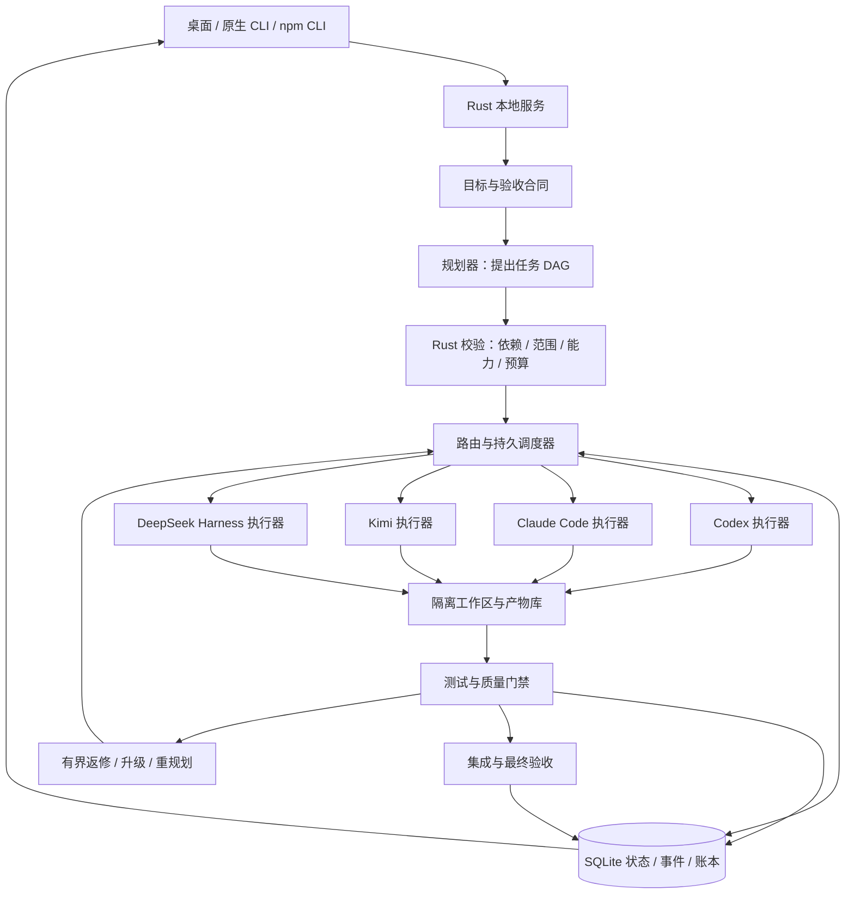
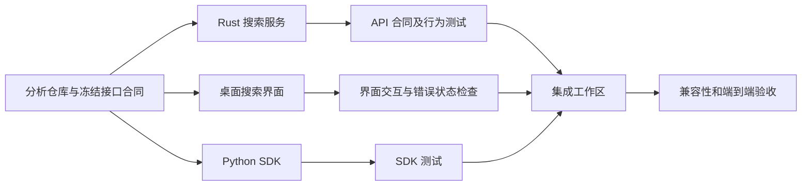

# Wonderland 多模型自主协作平台建设方案

日期：2026-09-19；修订：2026-09-21
项目基线：Wonderland 0.7.0，提交 `7afdcc963431`
文档性质：建设建议与验收设计；下文“新增”“目标”“建议接口”均不表示已经实现。

本文保留原始建设基线；后续已实现能力和源码整理见[开发文档索引](README.md)，发布实测以对应 VALIDATION 文档为准。

桌面完整产品范围另见 [桌面产品建设方案](DESKTOP_PRODUCT_PLAN.md)：Work/Chat、指定 AI 全程执行、官方应用中心、任务/看板/项目、插件、连接应用、定时任务、远程控制、PR 与网站。

## 1. 建设方向

把 Wonderland 建设为 **Rust 编写的多模型任务编排工作台**：用户提出目标、验收要求和预算，系统判断是否需要拆分，选择合适的模型及其原生工具执行子任务，验证产物，处理失败与冲突，最后交付可检查的完整成果。

你的核心想法可以归纳为：**在可验证的质量要求下，选择成本合适的“模型＋工具执行环境”，并让多个执行环境可靠协作。** 官方工具包含上下文管理、工具循环、权限、缓存、会话恢复等行为，所以调度对象不能只有模型名称。

建议使用以下执行器身份：

```text
ExecutorProfile =
  提供商 + 模型标识 + 工具及版本 + 接口版本
  + 账号引用/认证方式 + 推理配置 + 权限/运行环境
```

例如，`Codex 原生执行器`、`Claude Code 原生执行器`、`Kimi CLI/Code 原生执行器`、`DeepSeek Harness 执行器`分别登记。自主调度的候选只包含模型对应的官方执行工具；API 密钥与订阅账号属于这些工具的认证及计费方式。

**2026-09-20 补充的三项硬要求：** 每次开始计算或重新计算模型分配权重前，在线核验并取得 LiveBench 当前公布的最新数据；每轮路由和实际派工前核验对应调用渠道的最新价格/订阅计费资料；每个模型调用都必须由该模型自身官方执行工具完成。任一必需条件无法核实时，相关候选不可进入自动派工，不以静态评分、旧价格、零价格或其他工具静默替代。具体数据流程见第 6.6–6.9 节。

建设原则：

1. **Rust 负责调度与产品；原工具负责其模型执行循环。** Node/Python CLI 可以作为独立进程运行，不要求把它们改写成 Rust。
2. **复用上游公开接口，不维护官方项目的大型分叉。** 上游源码用于研究、构建或排查；主工程只维护适配器及兼容测试。
3. **先形成可靠闭环，再学习如何省钱。** 没有真实成功标签、完整账本和故障恢复，复杂路由算法没有可信训练依据。
4. **拆分也要计算收益。** 小任务允许单执行器完成；不为了“多模型”而增加规划、交接和审查开销。
5. **任务成功由验收证据决定。** 模型文字中的“完成”和进程退出码 0 都不足以代表项目完成。
6. **自动化遵守运行前确定的授权范围。** 范围内自主执行；缺少凭据、超出预算或遇到授权范围外动作时，给出明确状态和可继续入口。

首个产品目标是本机、多语言代码项目的自主协作。复杂研究、数据分析、写作可以复用任务和产物协议逐步增加，不把分布式集群、多租户云服务和所有非编程领域一起塞进首版。

2026-09-21 扩展：产品同时提供 Work 和 Chat，以及自动协作、指定 AI 完整执行、自定义团队和直接使用官方应用。应用中心覆盖 Codex、官方 Claude Code、Kimi CLI/Code、DeepSeek Harness、MiniMax Code、MiMo Code、ZCode；新增工具须逐项验证来源与接口。远程任务管理和远程执行纳入后续里程碑，首批从本机完整流程建立基础。

## 2. 当前代码基础与缺口

以下是本次对源码的只读检查结论；已有测试结果引用 0.7.0 验证记录，本次没有重新运行发布测试。

| 领域 | 当前能力 | 本轮建设应补齐 |
| --- | --- | --- |
| API 执行 | `agent.rs` 已有真实工具循环、流式事件、上下文压缩；`provider.rs`、`responses.rs`、`anthropic.rs` 支持多种协议 | 保留现有功能；新自主调度只经对应官方工具使用 API 密钥/订阅，旧 runtime 不进入候选池 |
| 模型选择 | `router.rs` 根据模型选择 wire 协议 | 增加基于任务、质量、成本、账号容量的执行器选择；协议路由不能替代调度 |
| 子代理 | `collaboration.rs` 有命名注册表；`agent_defs.rs` 的 FileAgent 有真实模型和工具循环；内置 Research/Expense 为演示返回 | 使用项目/运行/节点作用域注册；传入显式上下文，返回结构化产物、用量和状态 |
| 规划 | `planning.rs` 按句子产生线性步骤，反思主要检查输出是否为空或含失败文字 | 可校验的任务 DAG、输入输出合同、依赖、文件范围、验收条件和有界重规划 |
| 质量 | `evaluation.rs` 提供启发式分数与 JSON 记录 | 构建/测试/领域规则/独立评审的证据系统；现有分数不得作为路由训练中的真实正确率 |
| 官方 CLI | `desktop_bridge.rs` 探测入口并准备启动；终端可运行原程序 | 程序化启动、结构化事件、授权往返、会话恢复、取消和用量适配 |
| 工作区 | `desktop_workspace.rs` 有文件操作、语言识别、Git 状态与 diff | 子任务 worktree、基线快照、产物哈希、文件所有权、集成队列与冲突处理 |
| 会话与存储 | JSON 会话加 SQLite FTS5 检索层 | 独立的工作流事务库、事件日志、预算预占、租约、恢复与迁移 |
| 账号与连接 | API 连接、凭据存储、CLIProxyAPI sidecar 已存在 | 多执行器并存的账号引用、容量与健康状态；不能靠替换全局连接来执行并发节点 |
| 权限与隔离 | 权限管线、SandboxRun、进程树清理、原生 PTY 已有 | 官方子进程的权限映射与实际能力报告；worktree、PTY 和 SandboxRun 不能互相冒充隔离边界 |
| GUI | 项目、文件、变更、终端、CLI、连接设置已有 | 任务指挥台、任务图、待处理队列、预算/额度、验收证据与回放 |

**进入自主派工前必须处理的现有接口问题：** FileAgent 使用进程当前目录、环境变量模型和 `BypassPermissions`，返回纯字符串，未提供完整子任务计量。这些行为不能直接沿用到跨项目并行任务。文件代理注册表目前也不是运行隔离的，存在不同项目定义混用的可能。

此外，当前 runtime 的步骤完成标记与真实项目验收并非同一概念，反思的 `retry` 也不是持久重试调度。新工作流应独立建立状态机，复用存储、GUI、验证和进程管理基础设施，模型执行循环由对应官方工具承担。

还需改两处运行语义：现有聊天 SSE 断开会触发取消，自主工作流的存活必须与 UI 订阅分离；现有压缩用量进入 session 统计，却未完整并入单次 run 用量，不能直接作为新预算账本的完整数据源。

## 3. 总体架构



LLM 规划器可以提出拆分、分配理由和修复建议；Rust 调度器负责决定这些建议是否可执行。模型不能通过一句“请再启动几个代理”绕过节点数、预算、工作目录或权限限制。

规划、实现、模型评审、总结和模型压缩均适用官方工具约束；Rust 校验、编译器和测试运行器不是模型调用。首个规划器也通过该约束筛选，依据用户目标和项目元信息进行初始路由，不用一个未计量的通用模型调用绕过规则。

以单机常驻服务为第一阶段运行形态：GUI 关闭后可选择继续后台运行；CLI、npm 与 GUI 操作同一个工作流服务。先采用 SQLite、文件产物库和 Tokio 有界队列，规模证明确有需要后再扩展远程 worker。

事件订阅是观察通道，断开订阅不会隐式结束工作流；暂停、取消和关闭服务均使用显式控制操作。旧聊天的取消语义可保留，新旧接口需要清楚区分。

Rust 服务拥有任务进程、权限请求与预算；GUI 只是客户端。GUI 关闭后，新的待批准请求保存在服务中并进入待处理队列，达到配置的等待期限后暂停或取消对应 attempt，不自动同意。GUI 关闭、服务正常退出、进程崩溃和系统重启分别定义并测试生命周期；恢复入口不能依赖已经消失的弹窗。

### 3.1 官方工具接入策略

| 执行器 | 建议接入方式 | 设计边界 |
| --- | --- | --- |
| Codex | 桌面深度集成优先 `codex app-server` 的 stdio 结构化协议；批处理可用 `codex exec --json` | 原生管理会话、工具、权限和登录；按实际版本探测恢复、事件和用量；不解析 TUI 文本作为主协议 |
| 官方 Claude Code | 官方 headless/stream JSON 或官方 Agent SDK，经窄适配层连接 Rust | 优先保留其原生工具循环与权限；本地 `claude-code` fork 不能充当官方能力证据 |
| Kimi CLI | 桌面优先 Wire，通用互操作使用 ACP；print 只用于与其权限行为相容的场景 | 本地版本的 print 自动批准工具，不适合作为桌面审批主通道；流式粒度和用量逐项探测 |
| Kimi Code（Node） | 优先 ACP；需要额外能力时由项目自有 sidecar 调用官方 SDK | 本地来源为 MoonshotAI/kimi-code；与 Python CLI 区分；prompt 模式的自动权限不能冒充交互授权 |
| DeepSeek Harness | 优先 ACP 完整会话接口；headless/SDK 用于能力匹配的批处理 | 本地来源为 deepseek-ai/deepseek-harness；显式指定 profile；精简 SDK 的恢复/取消/权限能力不能凭空补齐 |
| CLIProxyAPI 连接辅助 | 仅在目标官方工具明确兼容且模型身份可核验时辅助连接 | 不进入执行器候选池，不绕过原生工具、不换模型、不隐式回退；不兼容的组合标为不可用 |

Codex 的 OpenAI 官方文档已经核对：app-server 提供初始化、thread/turn、流式通知、权限请求、恢复与中断；schema 可以从所用 CLI 版本生成。`exec --json` 提供 JSONL 事件，可指定输出 schema，并可按 session ID 恢复。优先选择本机 stdio；文档中的实验接口不直接成为生产依赖。来源见文末。

原生执行器的登录沿用原工具的正常登录过程。GUI 可统一呈现账号状态和登录入口，但不要求复制每个工具的凭据文件到通用代理。账号与功能是否可用，以实际授权及接口探测为准。

本次源码核查发现几个会直接影响实现的细节：

- 现有 DeepSeek 默认桥接入口是裸 `dsh`，而参考版本要求显式 `--profile`。应分别配置 ACP、headless 和人工 TUI 入口；找到可执行文件不能算执行能力验收通过。
- Kimi Python `--print` 自动批准工具并忽略用户提问；Kimi Node prompt 模式同样切到自动权限。自主运行须选择与授权合同匹配的接口，不能把 print 当成统一默认答案。
- 两个 Kimi 实现的 `stream-json` 均有文本缓冲行为，不能仅凭格式名称就承诺逐 token 输出或完整推理/用量事件。
- 官方 Claude headless 文档中的 `--permission-prompts` 要求 2.1.259 或以上，而既有验证记录中的本机版本是 2.1.193。需要版本探测，或选用经验证的 SDK 权限回调，不可按新文档直接假设旧版支持。
- DeepSeek 当前精简 SDK 的初始化、prompt 和关闭接口不等于完整会话控制；需要恢复、取消和授权往返的工作流应核对 ACP 能力。

采用 SDK 时还要核对默认系统提示、项目设置、工具集合及权限是否与目标原生 CLI 一致；不能只因 SDK 来自同一厂商就假设所有默认行为等价。官方 Claude 文档指出 `--bare` 不读取订阅 OAuth，订阅执行器不可默认启用该参数。

### 3.2 适配器合同

每个适配器至少提供以下语义，具体协议和类型由实现阶段确定：

```text
probe()                 -> 身份、版本、能力、健康状态
start(TaskEnvelope)     -> AttemptHandle
events(handle, cursor)  -> 有序事件流
respond(request, reply) -> 权限或用户输入应答（若支持）
cancel(handle)          -> 请求取消，随后确认最终状态
resume(reference)       -> 原生恢复或明确报告不支持
collect(handle)         -> TaskResult + ArtifactManifest
```

标准事件包含 `Started`、`TextDelta`、`ToolActivity`、`PermissionRequested`、`UsageUpdated`、`ArtifactProduced`、`Completed`、`Failed`、`Interrupted`，并保留脱敏的原生事件引用。未知事件可记录与降级显示；缺失结束事件、协议损坏和用量不可得必须显式呈现。

能力表区分“原生支持”“适配实现”“仅交互可用”“不支持”“待验证”。缺少程序化授权应答的 CLI 只能在明确预设权限的任务中运行，或者进入人工接管；不能通过自动批准一切来弥补接口缺口。

持续兼容机制：固定已验证版本范围，保存协议样本，启动时探测，升级后运行契约测试，不兼容版本进入待验证状态。执行中的任务使用启动时绑定的版本与配置，不在中途切换。

### 3.3 模型与官方工具的强制绑定

维护版本化的允许映射：OpenAI 模型→Codex，Anthropic 模型→官方 Claude Code，Moonshot 模型→官方 Kimi CLI/Code，DeepSeek 模型→官方 DeepSeek Harness。这里每一对都须进一步确认具体模型、接口、账号方式和版本确实受支持，不能把“同一厂商”当作无条件兼容。新增厂商也必须先登记其官方执行工具及验证证据。

验证资料包含官方发行来源、已解析程序/SDK 路径、版本、校验值（如可得）、协议能力、脱敏配置快照、请求模型 ID、原生工具报告的实际模型 ID、别名解析依据和账号计费渠道。普通模型 API SDK 不等于官方执行工具 SDK；本地 Claude fork 不能进入官方候选。

派工前核对 LiveBench 条目、计费项和执行器模型身份。运行中遇到自动换模型、别名漂移或与绑定配置不符，停止该候选的后续派工，记录实际尝试和成本并重新评估；已经发生的动作不因身份错误而从账本消失。原生会话若无法报告或以公开配置可靠确定模型身份，则标为身份未核验，不声称满足本规则。

原生工具内置子代理、压缩和辅助模型调用同样受约束。跨厂商子任务必须返回调度器，由另一厂商的官方工具执行；不能把 DeepSeek 配入 Claude Code 的自定义 provider 就当作 DeepSeek 官方执行。无法限制或核验内部模型选择时，先禁用相关能力；若仍不能符合要求，该执行配置不进入自动候选池。

工具未安装、来源不明、不支持目标模型或认证、版本不兼容时，排除该配置。允许重新选择另一组“模型＋自身官方工具”；没有合格组合时进入 Blocked，并明确原因，不能回退到 Wonderland API runtime、通用代理或其他厂商的工具。

上述自动重新选模只适用于允许自动选择的运行策略。用户指定模型整项执行时，规划、实现、模型评审和总结均绑定该模型/工具配置；失败不能擅自换模型。官方工具内部无法锁定模型的配置只可标为“指定应用，模型由原工具管理”，不能冒充模型全程锁定。新增 MiniMax、MiMo、ZCode 的具体来源与接口登记见桌面产品方案。

## 4. 一个任务怎样自主完成

### 4.1 从用户目标得到执行合同

输入应包含目标、项目路径、交付物、验收条件、预算/额度、期限和允许执行的动作。能从仓库推断的语言、测试入口、格式化命令、当前 Git 状态自动读取；真正缺失且影响执行的信息才需要补充。

Work/Chat 是产品场景；自动团队/指定 AI/自定义团队是执行策略；仅规划/实际执行及其权限是操作范围，三者分别建模。以下是流程入口，完整交互见桌面产品方案：

| 模式 | 用途 |
| --- | --- |
| 仅规划 | 生成任务图、候选执行器、成本区间与验收计划 |
| 授权范围内自动执行 | 自动派工、测试、有限返修、向独立集成工作区收集成果；遇到范围外动作暂停对应节点 |
| 指定 AI 完整执行 | 绑定用户所选模型与其官方工具，负责整项任务；不自动换模型，仍有预算、测试和交付验收 |
| 手动调度 | 用户指定执行器、调整依赖、接管 CLI；其操作仍进入同一事件记录 |

运行策略可以复用项目默认值。不要要求用户逐个确认所有普通子任务。

### 4.2 子任务必须有可检查的输入输出

建议 `TaskNode` 包含：

```text
id, run_id, graph_revision, dependencies
objective, acceptance_criteria, task_kind, criticality
input_artifact_refs, output_contract, context_manifest
base_revision, workspace_ref, declared_read_scope, declared_write_scope
required_capabilities, language_environment, permission_profile
executor_constraints, budget_reservation, deadline
max_attempts, timeout, cancellation_policy
```

`TaskResult` 至少包含状态、产物清单、实际修改范围、验收证据、未解决事项、原生会话引用、执行器配置快照和用量可信度。纯文字总结只作为其中一个产物。

规划校验检查：DAG 无环、依赖与产物引用存在、节点具有验收方法、候选执行器满足能力、写入冲突有明确处理方式、任务规模和未来验收预算可接受。

### 4.3 调度与状态机

状态按三个层级分别建模，不能把执行器退出与节点验收混为一谈：

| 层级 | 建议状态与成功条件 |
| --- | --- |
| Workflow | Draft、Planned、Running、Waiting、Paused、Succeeded、Failed、Cancelled；Succeeded 要求项目级验收通过 |
| Node | Pending、Ready、Active、Verifying、NeedsRevision、Accepted、Blocked、Failed、Cancelled、Skipped；Accepted 才能提供有效下游产物 |
| Attempt | Reserved、Starting、Running、WaitingForInput、Cancelling、Succeeded、Failed、Cancelled、UnknownOutcome；Succeeded 只说明本次执行正常结束，仍须验证 |

节点主路径为 `Pending → Ready → Active → Verifying → Accepted`。失败或返修建立新 attempt，受次数、预算和截止时间限制。无法判断外部执行结果进入 `UnknownOutcome`，先核对，不能盲目重发。

审批拒绝终止该操作；节点能否换用允许的方法由合同和策略决定。等待超时、重试耗尽进入明确失败/阻塞状态；依赖取消使下游阻塞或取消，必需节点不可通过标为 Skipped 来绕过验收。“暂停派工”只停止新 dispatch，已经运行的节点继续；停止运行节点应使用单独的取消操作。重复终态事件幂等处理，迟到完成不能把已取消工作流直接改为成功。

父任务在最终集成验收通过后才进入成功状态。子任务文本回答完成、单个工具成功或全部子节点局部通过，都不能直接替代父任务验收。

只调度依赖已通过的 ready 节点。并发同时受 CPU/内存、账号并发、提供商速率、文件写入范围和预算预占控制。原生工具内部已有子代理时，同样核对第 3.3 节的模型绑定要求，并尽可能计入总并发；仅数量无法完整观测时降低外部并发并标明统计不完整，模型身份无法核验时则不得派工。

默认采用有界返修策略，例如一次局部修复、一次执行器升级；具体次数是项目配置，不是无限自我反思。失败分类包括工具/环境失败、限流、登录失效、能力不匹配、质量不达标、集成冲突，分别采取恢复、等待、换执行器或调整任务结构。

有循环的“实现—验证—返修”通过新增 attempt 或新图版本表达，不往已记录的 DAG 内偷偷添加回边。改变上游产物后，应使依赖旧产物哈希的后续结果失效。

协作不局限于最初一次拆分。执行器可通过结构化消息提出 `RequestArtifact`（请求产物）、`ClarifyContract`（澄清合同）、`ProposeSubtask`（建议新子任务）和 `ReportBlocker`（报告阻塞）。协调器将消息绑定到节点与产物版本，再由调度器校验后续动作；不让各 CLI 私下无限递归启动其他代理。第一版只开放一层受控委派，后续依据并发和成本证据调整。

### 4.4 恢复与防重复执行

工作流状态、预算预占、dispatch intent 先在事务中落盘，再启动外部进程。记录 run/node/attempt ID、原生会话 ID、进程标识及事件序号，用租约和心跳判断存活。

调度服务重启后先核对已有进程、原生会话和工作区，再决定继续读取、恢复或建立新 attempt。对无法确认的外部动作进入 `UnknownOutcome`。不能宣称跨所有 CLI 实现 exactly-once；目标是幂等派工、事件去重、可核对的异常状态，以及不盲目重复有外部影响的动作。

租约带递增代数，提交状态和产物时检查代数，拒绝旧 worker 的迟到提交；仅防数据库重复不足以阻止旧进程继续写文件，因此旧工作区必须隔离，确认旧进程停止后才重新安排有冲突的任务。进程身份结合 PID 与启动信息，避免 PID 复用导致误接管或误终止。

取消也有阶段：发出取消、等待原生中断、必要时清理进程树、保存产物和用量，再释放预占。不把“已发取消请求”显示成“已确认停止”。

## 5. 如何真正控制质量

### 5.1 四层验收

| 层次 | 证据 | 适用对象 |
| --- | --- | --- |
| 合同检查 | schema、产物存在、文件范围、接口签名、引用完整性 | 所有子任务 |
| 确定性检查 | 编译、类型检查、已有测试、针对行为的回归、迁移/兼容检查 | 编码、计算和结构化产物 |
| 独立评审 | 根据需求和 diff 检查遗漏、边界、接口设计；标出证据位置 | 重要变更、难以自动判定的任务 |
| 端到端验收 | 集成后完成原始用户场景；必要时人工抽检 | 整个任务 |

测试由宿主验证器执行并保存命令、环境、退出码、日志和被测 revision。防止执行器用删除测试、弱化断言、修改验收脚本等方式获得表面通过；验收合同变更需要单独记录。研究用隐藏测试与训练/规划上下文隔离。

模型评审可提供补充证据，但不能由执行模型给自己一个分数就判定成功。可在关键节点使用不同执行器复核，是否值得增加评审成本由实测收益决定；“换品牌”不自动保证错误独立。

UI 同时展示预测的通过概率、实际验收结果和证据完整度，不合成一个看似精确却无法解释的万能质量分。

### 5.2 原生工具适配效果如何验收

对每个工具分别做两组配对任务：

1. 在原工具中直接运行。
2. 由 Wonderland 适配器启动同一工具。

固定模型、推理设置、工具版本、项目基线、账号类别、权限和任务要求，比较成功率、工具能力、延迟、用量、恢复和授权行为。出现差异时检查适配损耗和配置差异。

这项实验验证“集成是否保留原工具能力”。多模型路由是否更省钱是另一项实验，需要和各单执行器及固定分工策略比较。两者必须分别报告，避免把工具环境的差异误归因于路由算法。

无法获得某提供商的真实账号验证时，对应状态只能是协议测试通过或待实测，不能写成效率已经相当。

## 6. 成本、额度与路由算法

### 6.1 全流程记账

一次任务的成本至少覆盖：

```text
规划 + 所有执行 attempts + 上下文整理/压缩 + 验证模型
+ 返修与升级 + 集成返工 + 实际付费工具/运行资源
```

人工处理时间、端到端耗时和订阅额度分别记录；如转换为货币，转换规则必须显式配置，不能无说明地混入 API 账单。

按各提供商账单语义归一化 token。通用表达可以使用互斥类别：

```text
C_api = 普通输入量×普通输入价
      + 缓存读取量×缓存读取价
      + 缓存写入量×缓存写入价
      + 输出量×输出价
      + 其他独立计费项
```

这里各类别如何拆分必须由适配器依据提供商定义处理。例如原始 input 总数若已经包含缓存命中，不能在完整 input 收费后再把缓存读取全部加一次；推理 token 若已计入输出也不能重复收费。原始用量、归一化规则版本、价格来源及生效时间均保存。

用量状态设为 `reported / estimated / partial / unknown`。没有用量时显示“未知”，不填 0。

### 6.2 订阅不是免费无限资源

API 与订阅的优化目标分开：

| 资源 | 建议记录 |
| --- | --- |
| API | 实际账单、预估区间、限额与速率 |
| 订阅 | 订阅摊销口径、当期额度消耗或可用容量、限流/重置时间（若可得） |
| 所有执行器 | 耗时、失败率、账号并发与关键任务所需的保留容量 |

可向用户提供“现金支出优先”“保留订阅额度”“完成时间优先”策略。不能把订阅节点都设成零成本后无限派工，也不能把不可获得的剩余额度伪装成精确百分比。

### 6.3 调度前预占

在事务中检查：

```text
已结算 + 运行中预占 + 新节点预占 + 剩余必需验收预留 <= 预算
```

同时为未来关键节点预留资源，防止便宜的前置任务把整笔预算花掉。完成时结算并释放差额；流式用量增长时重新估计。

无法从上游实时获知消费或设置硬限制时，只能提供有缓冲的软预算和停止策略，不能承诺绝不超额。产品显示硬限制、软限制或不可精确控制的实际状态。预算不足时暂停、缩减尚未执行的非必要工作或提出替代方案，不静默降低验收标准。

### 6.4 分三步建设路由

**第一步：可解释的约束路由。** 先完成最新 LiveBench/价格快照和官方工具绑定校验，再根据工具能力、语言/环境、账号、权限、上下文容量、可靠性和任务类型筛选候选；在满足验收风险要求的候选中选择预计总成本较低的方案。把失败后的预期返修成本和关键路径等待计入比较。

早期质量证据不足时使用保守策略和校准集。可保留论文中的 QCG 名称，但应明确选择最小预期成本，或者诚实地把算法目标称为多目标效用优化；二者不能混为一个定理。

**第二步：数据驱动预测。** 学习每个“执行器配置 × 任务特征”的通过概率、成本和耗时分布。每轮必须使用最新核验的 LiveBench 数据作为能力依据，并结合代码规模、依赖层级、修改范围、测试可用性、历史返工等进行本项目校准。LiveBench 基准分数不直接等于复杂项目成功概率；评估概率校准与版本漂移，不只看分类准确率。

**第三步：受约束的在线探索。** 有足够记录后再比较 contextual bandit 等方法。先离线回放、影子决策，再在有探索预算的低风险任务中启用；保存候选集合、选择概率与策略版本，处理选择偏差。关键任务默认不承担探索成本。

规划节点、代码节点、审查节点也参与同一成本核算。不要固定“某品牌永远规划、某品牌永远写代码”，也不要默认每个任务都惩罚重复使用同一模型；相同执行器可能受益于缓存、会话连续性和上下文保留。

### 6.5 建议研究形式化

以运行策略 `π` 为研究对象，包含拆分、执行器选择、并发、重试和停止规则。API 场景指对应官方工具使用 API 计费凭据：在质量、截止时间和资源约束下，最小化期望完整账单 `E[C_total(π)]`。

路由前使用经校准的成功概率估计及不确定性；最终成功标签来自验收。预测满足阈值不等于真实任务必然通过。项目级成功也不能简单取各子节点分数平均。

订阅场景单独做多资源约束实验，报告现金、额度和时间的权衡。只有在明确摊销/机会成本口径后，才与 API 转换为同一种标量目标。

### 6.6 每轮权重计算前更新 LiveBench

用户指定的数据源为 [livebench.ai](https://livebench.ai/#/)、[LiveBench/new-livebench](https://github.com/LiveBench/new-livebench) 和 [LiveBench/LiveBench](https://github.com/LiveBench/LiveBench)。本次已读取网站实际加载的数据，以及两个仓库的说明和排行榜计算代码；分工如下：

| 来源 | 使用方式 | 不承担的用途 |
| --- | --- | --- |
| `new-livebench/public/table_<date>.csv` | 模型 × 子任务的原始分数，范围 0–100 | 不能直接当作本项目成功概率 |
| `new-livebench/public/categories_<date>.json` | 当前评测版本的类别→子任务映射 | 不能用旧分类解释新版本分数 |
| `new-livebench/src/lib/constants.js`、`src/Table/modelLinks.js` | 已发布版本清单、模型厂商/名称/推理变体等元信息 | 展示名称和模型家族不是实际调用 ID 的可靠替代 |
| `new-livebench/public/cost_<date>.csv` | 可选的评测运行成本、样本数、token 与价格参考 | 不是保证实时更新的厂商/账号报价 |
| `new-livebench/src/lib/compute.js`、`src/Table/Averaging.js` | 核对官网分数与历史成本聚合口径 | 不把网站的展示合并规则直接当路由规则 |
| `LiveBench/LiveBench` | 评测实现、题集来源、评分方法、变更说明和研究复现参考 | 每次刷新权重无需安装/运行全套 benchmark，也无需调用模型重新跑榜 |
| `livebench.ai` | 核对当前对外发布版本和同版本数据 | 不以截图、搜索摘要或 README 旧示例判断最新版 |

**刷新时机：** 新工作流的首次权重计算、任务拆分后的新一轮分配、返修/升级/重规划的重新选模，以及用户要求重新评估时，都启动新的 `RoutingEpoch`。每个 epoch 必须在线核验发布信息和数据版本；不能仅因本地缓存“尚未过期”就跳过本轮核验。同一轮对多个候选/节点可以共享同一已核验快照，不必按模型重复下载相同文件。

建议流程：

1. 获取当前发布清单和仓库提交标识，确认最新完整发布；目录中有日期较新的文件但未宣布发布时，不自行当作新榜单。
2. 固定一次 commit，读取该 commit 下的 table、categories、模型元信息及计算规则，避免从移动的 main 分多次读取时拼成不同版本。核对网站发布信息；出现网站/仓库部署不同步时重试，仍不能确定最新完整发布则进入来源不一致状态。
3. 使用条件请求重新验证未变化的数据；有效 304 可以复用本地内容，但记录本次核验时间。连接失败不等于 304，不能据此把旧缓存标成最新。
4. 校验 HTTP 状态、格式、schema、数值范围、重复模型 ID、类别列、缺失值、文件哈希和解析器版本。完整校验通过后原子发布快照；缺失/非法分数不是 0。
5. 将榜单条目精确映射到实际模型、版本及推理档位。同名 `latest` 别名、high/low effort、不同日期快照不能随意合并；网站为展示而折叠到家族最高分的逻辑不用于调度。
6. 保存 `release_id`、`source_commit`、`source_url`、`content_hashes`、`checked_at`、`source_updated_at`（若可得）、`parser_version`、`mapping_version` 和本轮选用行。来源发布时间未知时不编造日期。

官网本次读取的发布清单末项为 **2026-06-25**，已成功读取对应 table/categories/cost；这是 2026-09-20 核查所得的来源状态，**不是代码中要写死的版本**。重新获取当日最新公开数据，不代表 LiveBench 在当天重新评测了每个模型。UI 同时显示“评测版本”和“刚刚核验”等时间信息。

未上榜、缺少任务相关类别、推理变体不能对应、版本身份不清的模型不参与自动权重分配，明确标记原因；不能借用相似名称或旧模型分数。网络不可用、限流、格式变化或发布不完整时，保留旧快照供历史查看，暂停依赖新权重的派工并显示 `WaitingForBenchmarkData`。其他已绑定的运行节点继续按原合同执行。

用户在 Chat/Work 中直接指定模型时不进行候选权重竞争，因此未上榜本身不阻止手动选择；显示未评测状态，继续核验官方工具、模型身份与适用报价。只要用户切回自动选择，仍必须在线刷新 LiveBench。应用中心仅打开原生 CLI 不发生模型调用；非托管 CLI 后续由用户手动操作，必须显示不可完整管控的费用/模型切换边界，不将其冒充满足自动调度合同的运行。

两个仓库按只读数据/参考依赖管理，保存来源与 commit，不把 React 项目移植进 Rust GUI，也不自动执行下载来的 JS 或 Python。Rust 适配器解析数据与受控的静态元信息；上游格式改变时更新解析器和契约样本。

### 6.7 官方价格与计费渠道动态核验

价格服务独立于 LiveBench：同一模型的 API、订阅、地区、服务档位、长上下文、缓存读写、批处理及工具费用可能不同。只有该官方工具实际可用的渠道和折扣才能进入报价，不能用不支持的批处理低价估算交互任务。

来源顺序为：**实际渠道的官方账号报价/计费接口（若提供）→官方机器可读价格资料（若提供）→官方定价页面的受控解析**。账号专属合同价或订阅权益也必须有可核验的适用依据。第三方汇总及 LiveBench 成本表只用于交叉检查；不作为无提示替代。

每条 `PriceQuote` 包含：

```text
provider, canonical_model_id, account_billing_channel, currency, unit
region, service_tier, context_band, input/output/cache/tool rates
subscription_plan/entitlements（适用时）, eligibility_conditions
source_url, source_hash, checked_at, effective_from/to（若公布）
parser_version, quote_status, completeness
```

“实时”在本方案中落实为每轮路由主动查询、实际派工前再次核验、发现变更后更新未执行任务的估价与预算预占。并行的一批 dispatch 可以共享在该批开始时核验的报价版本；长时间排队后不能直接沿用早先报价。长任务期间按数据源限制进行周期核验；若官方提供变更通知则消费通知。通用上游没有统一实时价格 API，不能承诺在厂商修改价格的同一毫秒已知。

价格无变化时可通过在线条件验证复用内容；价格变化则产生新报价版本，重新检查现金预算、订阅容量与候选排序。正在运行的 attempt 不因为价差自动切换模型或破坏会话，实际费用仍按提供商结算，并保留原估价和差异原因。

官方价格无法获取、含义无法解析、渠道不匹配或关键计费项缺失时，该渠道标为 `PriceUnverified`，不参加自动成本优化；可继续选择其他已核验且符合官方工具要求的候选。没有可行候选则 `WaitingForPricingData`。旧价可展示为历史参考，不能显示为当前价格；没有公布生效时间不能推测为抓取时间。

订阅核验的是套餐、适用权益和可获得的额度/限流信息，不能强行换算成虚构的 token 单价。权益已核验而具体剩余额度不公开时，显示容量未知并使用保守并发；账本保留不确定性。身份未核验或权益不可确认的账号不派工。

### 6.8 权重的形成与快照绑定

本方案中的“权重”是**模型/执行器选择的评分与分配权重**，不是修改模型神经网络参数。计算顺序固定为：

```text
在线更新 LiveBench 与官方报价
  → 对齐榜单条目、计费模型、实际执行模型身份
  → 过滤官方工具、账号、能力、权限和预算不合格组合
  → 根据任务相关的 LiveBench 分项能力及本地验收记录评分
  → 比较包含返修/交接/等待的预计总成本
  → 保存决策快照 → 原子预算预占 → 官方工具执行
```

每个任务从当前版本 categories 动态识别相关类别。代码任务关注 Coding/Agentic Coding，数学或资料任务选择相应类别；可以定义 `L(m,t) = Σ a(t,k) × score(m,k) / 100`，其中 `a(t,k) >= 0`、总和为 1，任务类别权重有版本和理由。这是 Wonderland 的任务相关指标，不能标成 LiveBench 官方 Global Average。

展示官网指标时依据上游该版本的聚合口径并记录规则来源；路由使用原始分项与明确的缺失覆盖策略。不能将全部子任务简单平均后冒充官网总分，也不能把“每个 LiveBench 分数点的成本”当作本项目“成功交付的成本”。

用最新 `L(m,t)`、执行器配置和本地验收记录校准通过概率及不确定性。LiveBench 是每轮必需的能力输入，本地记录补充官方工具、项目和流程的实际表现；它们都不能替代最终测试门禁。模型版本或推理设置改变后，历史表现按配置拆开记录，不无条件继承旧版高分。

`RoutingDecision` 保存 `routing_epoch_id`、任务特征/策略版本、`benchmark_snapshot_id`、相关 `price_quote_id`、模型映射版本、执行器配置指纹、完整候选与排除原因、选择理由和预占金额。重放历史决策读取原快照；线上重新做分配则必须重新核验来源，两种行为明确区分。

### 6.9 更新故障、执行绑定与验收

数据更新按候选局部失败处理：某家价格不可用只排除该渠道；整份必需榜单无法验证则阻止新的自动权重轮次。可读旧结果、查看证据、取消任务和继续已绑定执行，不因一个数据源中断冻结整个 GUI。

必须增加的验收案例：

- 每个新的权重轮次都有在线核验记录；缓存命中不能绕过该记录。304、超时、429、404、返回 HTML、损坏 CSV 和日期回退分别处理。
- 新 release、同 release 数据修订、分类改变、缺失 cost 文件、模型未上榜、推理变体和别名漂移均有回归样本；不混用跨 commit 文件。
- 官方价格涨降、上下文阶梯、缓存计费、货币单位、账号折扣资格和订阅未知额度可正确区分；不会将历史成本/缺失值当新报价/零价。
- 并发派工遇到价格更新时，以事务核验报价版本和预算预占；已运行节点与待运行节点分别处理。
- 官方程序被 fork 替换、配置改向其他厂商、内部子代理跨厂商、实际模型与请求不符、工具缺失时 API 回退都必须被拒绝或明确中止。
- 任何模型调用，包括规划和模型评审，都能追溯到官方工具、模型配置、榜单依据和适用报价；不能有未登记的隐含调用。

## 7. 工作区、上下文和多语言支持

每个并行写代码节点使用独立 Git worktree，绑定输入 revision 和前置产物。用户未提交改动先形成可追踪快照或补丁输入，不丢弃、不擅自清理。非 Git 项目使用独立快照目录。worktree 解决修改冲突，不提供操作系统安全隔离。

声明写入范围用于调度冲突检测；若需要强制阻止越界，必须使用真正的权限/文件系统边界。无法提供该边界的工具不接收要求强隔离的任务。验证构建脚本本身也受运行策略约束。

产物以引用交接，例如：

```text
接口合同 + 必要源文件切片 + 基线 revision
+ 已验收补丁/数据/文档 + 测试证据 + 未解决事项
```

不把所有代理的完整聊天记录广播给每个模型。原生会话由原执行器保管；跨执行器传递明确产物与决策摘要，不尝试迁移私有推理状态、供应商专属签名或不兼容的工具消息。

上下文清单区分用户授权、项目规则、参考资料和工具输出。仓库内容、网页及子代理产物不能自行提升权限或改变预算。敏感文件通过执行器数据策略控制；日志脱敏后才能进入共享索引或研究数据集。

长期记忆优先保存已验收的项目事实、环境修复步骤和接口决策，附来源、适用 revision 与失效条件。未验证的代理推测不能直接写成全局事实；模型或工具升级后也不能无条件沿用旧能力评分。

集成器以稳定次序把通过验收的补丁应用到独立集成分支，重新执行组合测试。共享锁文件、公共 API、配置和数据库迁移等高冲突文件安排单一负责人或串行节点。冲突产生专门修复任务，不能只拼接各模型的最终回复。

语言支持采用可扩展 `ProjectAdapter`：发现 manifest、环境要求、构建/测试/格式化命令、产物规则。首批覆盖 Rust、Python、JavaScript/TypeScript；随后补齐 Go、Java/Kotlin、.NET。命令以程序与参数数组表达，避免将模型文本直接当 shell 拼接。

现有 SandboxRun 只覆盖其提交的代码。外部 CLI 的完整行为须使用其原生沙箱或独立 OS/容器环境并报告实际保障；缺少强隔离时不能因为设置了一个字段就显示“安全沙箱已开启”。

## 8. GUI 建设：面向任务的指挥台

本节是任务执行视图；完整桌面导航、Work/Chat、应用内直接使用官方工具、指定 AI 任务及扩展功能见 [桌面产品建设方案](DESKTOP_PRODUCT_PLAN.md)。应用中心与任务总览是两个互通入口，不要求用户先使用自动团队才能调用某个官方工具。

继续使用 Rust/egui，保留已有文件、变更和终端组件，新增统一的工作流视图。设计重点是让用户一眼看出“目标是什么、进行到哪里、为什么选它、是否需要我处理”。

| 区域 | 主要内容与交互 |
| --- | --- |
| 左侧项目与任务 | 最近项目、运行中/待处理/完成任务、可搜索历史；账号状态放入独立入口 |
| 中央任务总览 | 目标、交付清单、进度、当前瓶颈；任务 DAG 和列表可切换，小任务默认列表 |
| 节点详情 | 执行器/版本/模型、选择理由、输入范围、实时活动、文件变更、验收与失败原因 |
| 右侧资源栏 | 实际/预占/预估成本、订阅容量可信度、耗时、并发；未知值有明确占位 |
| 数据与选择依据 | LiveBench 评测版本/在线核验时间、官方报价来源与时间、模型映射、官方工具验证状态、候选排除原因；可查看本轮快照 |
| 底部工作台 | 原生终端、执行日志、验证结果、集成 diff；可折叠、拖动调整 |
| 待处理队列 | 权限、登录、缺失输入、冲突和预算事项；与具体节点绑定，避免重复弹窗 |

关键使用流程：

1. 输入复杂目标，选择预算/质量与授权策略；自动识别当前项目。
2. 查看规划，或依据保存策略直接开始；任务图显示分工和预计资源范围。
3. 运行中点击节点查看活动、证据和成本；支持暂停派工、取消节点、固定执行器、增加信息。
4. 需要人工处理时聚焦对应节点，保留其他可独立进行的工作。
5. 验收页展示最终产物、完整 diff、测试证据、成本分解和未完成项；可追溯到原生 CLI 会话。

“打开对应 CLI”继续存在，但应绑定节点的目录、工具版本和原生 session。只有接口支持附着/恢复时才展示“接管当前会话”；否则显示“在该工作区新开 CLI”，避免误导用户进入同一个运行。

视觉系统统一字体层级、间距、状态色、图标和焦点样式，适度使用层次和留白。动态图只呈现有意义状态，避免不断闪烁。支持中文输入、键盘导航、DPI 缩放和浅/深主题；状态必须同时有文字，不能仅靠颜色。

GUI 验收包括小窗口与高 DPI、长任务名、长模型名、断线重连、100 节点大图的列表退化、等待授权、未知用量及错误恢复。模型事件按帧合并更新，日志和长列表虚拟化，避免每个 token 触发全局重布局。性能指标在首轮样机上测量后锁定。

## 9. Rust 模块与数据设计

建议先在现有 crate 内分模块，边界稳定后再拆 workspace crates，减少初期迁移成本。

```text
src/orchestration/
  contract.rs       目标、节点、结果和版本化 schema
  planner.rs        规划调用与计划校验
  scheduler.rs      ready 队列、并发、取消、恢复
  routing.rs        候选筛选、选择理由、策略接口
  budget.rs         预占、结算、额度与价格语义
  store.rs          事务、事件、迁移和恢复查询
src/model_intelligence/
  livebench.rs      版本发现、官方 CSV/类别/元信息读取
  pricing.rs        各计费渠道官方报价适配器
  identity.rs       榜单模型、计费模型与官方工具映射
  snapshots.rs      不可变来源快照、在线核验、决策引用
src/executors/
  mod.rs            执行器合同、能力表和事件类型
  codex.rs / claude.rs / kimi.rs / deepseek.rs
src/artifacts/      内容哈希、上下文清单、工作区与集成
src/verification/   测试运行、证据、评审与项目级验收
src/project_adapters/  语言工具链与项目命令发现
src/bin/desktop/    增加工作流总览、节点、预算、验收视图
```

SQLite 新库建议包含 `runs`、`graph_revisions`、`nodes`、`edges`、`attempts`、`executor_snapshots`、`events`、`artifacts`、`verifications`、`budget_ledger`、`reservations`、`dispatch_intents`、`approval_requests` 等实体，使用外键、唯一键、事务和可回滚迁移。

数据更新增加 `benchmark_snapshots`、`price_quotes`、`source_checks`、`model_identity_mappings`、`routing_epochs`、`routing_decisions`。来源更新采用暂存→校验→原子激活，保留历史；报价和能力快照不会覆盖过去决策使用的证据。模型工具的允许映射也有独立版本。

大日志和二进制产物放内容寻址文件库；数据库保存路径、哈希、大小、来源及留存策略。原始用量与归一化用量同时保留。SQLite FTS 继续作为检索投影，不把现有“可重建会话索引”当成不可丢失的调度事实库。

产物先写临时文件、校验哈希并原子发布，再以事务登记引用；成功记录不得指向尚未写完的文件。崩溃后的孤儿产物通过引用扫描和保留期回收，缺失或校验失败的产物不能继续通过验收。

写入通过受控队列处理，SQLite WAL 支持并发读取；事件序号支持 GUI 断线续读。新增接口采用版本化路径，例如以下**建议接口，尚未实现**：

```text
POST /api/v1/workflows                 创建目标/规划或执行
GET  /api/v1/workflows/{id}            状态和图版本
GET  /api/v1/workflows/{id}/events     带游标的 SSE
POST /api/v1/workflows/{id}/control    暂停派工、继续或取消
GET  /api/v1/executors                 能力、版本、健康状态
GET  /api/v1/workflows/{id}/artifacts  产物与验收证据
```

CLI、npm、桌面共用服务合同。旧聊天入口继续使用原会话，不强行转换所有历史 JSON；新工作流通过关联字段引用旧 session。工作流、节点、attempt、工具会话四级 ID 必须分开。

## 10. 分阶段落地与退出条件

以下是以现有 0.7.0 为起点的初步工作量区间，单位为有相关经验开发者的人周；它是拆解预算，不是交付日期承诺。账号可用性、上游协议变化和平台测试会影响日历时间。GUI 从前期贯穿建设，不能全部留到最后。

| 阶段 | 交付物 | 必须满足的退出条件 | 初估 |
| --- | --- | --- | --- |
| M0 基线与合同 | 源码缺口记录、官方工具映射、任务/事件 schema、LiveBench/价格来源与解析合同 | 覆盖 cwd/权限/用量/项目作用域；完成两个 LiveBench 仓库数据核对与缺失/失联策略；费用口径可复现 | 1–2 人周 |
| M1 原生执行基础 | 单节点持久记录；Codex/Kimi 适配器及其 API/订阅认证；每轮榜单/报价刷新与节点 UI | 能启动、流式、授权、取消/恢复、采集产物；刷新失败/身份不符不能派工；真实任务验证 | 3–4 人周 |
| M2 最小自主闭环 | DAG、持久调度、工作区隔离、预算预占、测试门禁、集成、基础任务总览 | 两种执行器完成同一真实多文件项目任务；故障重启可恢复；失败不能假成功；用户改动保留 | 3–4 人周 |
| M3 四类生态覆盖 | 官方 Claude Code、DeepSeek Harness、经来源验证的 Kimi 变体；账号容量、契约回归 | 分别标记适配工程完成与真实模型验收通过；四生态完成要求每类真实验收；升级兼容可检测、上游源码未改 | 2–3 人周 |
| M4 产品化与多语言 | GUI 精修、回放、独立评审、多语言项目适配、安装/升级/CLI 一致性 | 用户可从需求到验收完成流程；打包升级保存数据；支持矩阵、局限与验证记录齐全 | 2–3 人周 |
| M5 路由研究与优化 | 校准数据、规则基线、预测器、影子策略、对照与消融报告 | 在冻结测试集报告质量/成本/耗时/人工介入和置信区间；无证据不宣称节省比例 | 3–5 人周 |

纳入每轮数据更新与官方工具强校验后，总计初估调整为 **14–21 人周**，覆盖 Windows 首版、Rust/Python/TypeScript 项目、四类执行生态与路由研究原型。完整统计实验的规模、其他语言、Linux/macOS 实机产品化和远程 worker 另行估算。多人可并行推进适配器、GUI 和评测，但 schema、状态机与证据口径必须先稳定；不能把总人周机械除以人数作为工期。缺少真实账号的适配器可达到工程完成，但该生态仍为待验收。

这一估计保留为 2026-09-20 的核心范围基线，不是 2026-09-21 扩展后的完整产品工期。新增七类应用中心、完整 Work/Chat、PR、网站、插件、定时和远程控制按桌面方案 D0–D5 实施，并在来源/接口和 WebView 验证后重新估算。M0–M2 与 D0–D2 共用服务与状态机；指定 AI 的完整工作体验应先于复杂自动协作策略完成。

优先选择 Codex＋Kimi 做首个闭环，是因为项目已有相关入口且用户允许使用 Kimi 账号测试；Codex 真实模型调用仍以本机可用授权为准。这是降低首批接入风险的工程顺序，不是永久角色分配。Claude 和 DeepSeek 接入规格应在 M0 就确定。

### 10.1 第一阶段的具体待办

1. 冻结 `TaskEnvelope / TaskResult / ExecutorCapabilities / RunEvent` 初版，建立官方工具允许映射、榜单与报价 schema，并完成每轮在线更新原型。
2. 把子代理模型、cwd、权限、取消、预算及运行身份改为显式参数，消除全局目录/连接依赖。
3. 为 Codex 和 Kimi 完成“读取项目—做小修改—运行测试—返回补丁”的真实适配试验。
4. 增加 SQLite 工作流日志及可回放 UI，先验证单节点的完整生命周期。
5. 再扩展为两个独立节点并行、一个集成节点串行的闭环。
6. 做进程崩溃、断流、取消、权限拒绝、数据源不可用、模型身份不符、变价、限流与预算不足的故障注入。

LiveBench/价格更新和官方工具绑定从 M0/M1 开始建设，首轮自动派工就必须生效。M2 验收以前，不将主要精力投入强化学习、自学习权重策略、几十个代理并发或复杂角色市场；规则评分同样使用每轮最新核验数据。

## 11. 一个具体的复杂任务示例

示例目标：为一个 Rust 服务增加任务搜索 API、桌面搜索界面和 Python SDK，并保持旧接口兼容。以下仅展示派工机制，不预先声称哪个品牌最适合某类任务。



规划器先识别共享 API schema；冻结后，三个实现节点分别在 worktree 中并行。路由器根据历史项目任务的通过率、预计总成本和可用账号，为节点从 Codex、Claude、Kimi、DeepSeek 等执行器中选择。某个节点没有合格候选时标记阻塞或重新划分，不能派给不满足条件的模型后仍宣称质量约束成立。

独立测试节点读取合同和产物。SDK 测试失败时只返修 SDK 节点；若根因是接口合同错误，创建新合同版本并使受影响的下游结果失效。集成之后再测实际桌面→服务→存储链路，最终交付代码、SDK、运行说明、验收记录和总成本。

若实测发现一个原生执行器完成全任务更快、更便宜且质量相当，路由应允许选单执行器。多模型是手段，交付质量和总成本才是目标。

## 12. 验收与论文实验设计

### 12.1 工程门禁

| 范围 | 关键检查 |
| --- | --- |
| 适配器契约 | JSON 分片/乱序或重复事件、未知事件、错误退出、授权等待、超时、用量缺失、版本不兼容 |
| 状态与预算 | 重复派工、并发预占竞争、崩溃恢复、取消后释放、数据库迁移；失联任务不会自动判成功 |
| 工作区与集成 | 同文件冲突、基线改变、非 Git 项目、未提交改动、产物哈希、验收脚本被修改 |
| 权限边界 | 越界路径、路径链接、跨项目代理定义、账号串用、授权范围变更；不自动退回无限权限 |
| 多语言与平台 | Rust/Python/TS 样例优先，随后 Go/.NET/Java；Windows 主体验，Linux/macOS 按实际测试支持 |
| GUI 与发布 | 启停、恢复、人工接管、中文 IME、高 DPI、小窗口、未知成本、升级回滚与包内凭据排除 |

先运行协议回放与离线故障测试，再用少量真实账号任务验证。真实验证记录明确工具版本、日期和覆盖行为；仅通过模拟测试的功能不能标为真实模型验证通过。

### 12.2 研究数据与对照

首批建议收集 20–30 个代表性仓库任务用于完善流程和估算实验费用；它们只作试验与校准。随后构建至少覆盖五种任务类别的独立测试集，并根据先导实验方差、目标非劣界和统计功效确定最终样本量，不能把“跑过几十次”当成充分统计证据。

任务类别包含跨文件功能、缺陷修复、测试补全、API/SDK 协作、依赖迁移/重构。按仓库与时间划分训练/验证/测试，防止同一项目的近重复任务泄漏。公开基准可作补充，不能只用 MMLU/GSM8K 得出复杂软件协作结论。

建议对照组：

1. 每个原生执行器单独完成整任务。
2. 校准集选出的高质量单执行器基线，以及低价单执行器基线。
3. 固定规则分工，多模型协作但不学习路由。
4. 质量约束的成本路由。
5. 学习型预测路由；数据充足后再加入受约束 bandit。

协作实验另外加入“同一执行器组成 DAG”和“高质量单执行器在相同预算内多次尝试”，区分任务拆分、多模型互补和单纯多花推理预算的效果。对小规模调度实例使用枚举或优化求解器作参照，量化启发式差距，不预设近似保证。

所有模型实验仍通过其对应官方工具。比较“直接运行官方工具”和“由 Wonderland 启动同一官方工具”以测量集成影响；固定工具后比较拆分、路由和预算策略。不得以研究消融为由改用通用 API Harness 或跨厂商工具；无法分离的模型与工具因素如实报告。

主要指标：项目级验收通过率、完整现金成本、每个成功交付的成本、P50/P95 完成时间、人工介入次数与分钟数、超预算率、返修率、恢复成功率。所有失败尝试进入成本分母；仅统计成功节点会高估收益。订阅另报额度/容量代理指标及其误差。

“每个成功交付的成本”按该策略全部测试运行成本除以成功交付数计算；同时报告总成功数和失败成本，成功数为零时不输出伪造比值。

实验固定或记录模型/工具版本、账号类别、推理档位、任务基线、缓存条件、MCP/技能配置、权限与环境。每个线上权重轮次仍重新核验榜单与价格；记录各轮快照，发生更新则按版本分层分析。离线重放既有决策使用旧快照且不实际派工。重复运行并随机化顺序，以配对分析和置信区间报告差异。

区分冷缓存与热缓存；重复任务的统计按任务/仓库聚类处理。订阅实验分别讨论“已经购买订阅时的增量支出”和“从零采购的总拥有成本”，避免把不同采购条件造成的差异当成算法收益。

质量优先使用预先定义的非劣性判据：在相同任务集上，质量相对基线的置信区间满足预注册的容许差，才比较节省。容许差由用途决定，不临时调低以获得好看的结果。40%–60% 节省可作为待检验假设，不能作为建设阶段保证。

策略对照可分别禁用自动拆分、升级策略、会话/缓存连续性或学习型路由；官方工具约束、数据核验、预算安全和最终验收一直有效。反事实路由在离线历史快照上分析。既报告收益，也报告协作成本高于单执行器的任务类型。

## 13. 对研究构想的必要修订

原文是研究输入，不是已完成实验或实现的证明。建议后续另行修订论文框架，本次不改动你的原文件。

| 原文位置/表述 | 建议修订 |
| --- | --- |
| 第 3 章按模型建模 | 扩为“模型—执行工具—配置”联合选择，加入交接、返修和集成成本 |
| 第 3.2.3 节基础费用再加缓存费用 | 根据实际账单语义拆分互斥类别，避免重复计费；时延单独报告或说明货币化口径 |
| 第 4.1 节质量过滤后最大化效用 | 明确是效用优化还是成本最小化；空候选集返回不可行/升级，不能用任意 fallback 继续声称保证质量 |
| 第 4.2 节 AMO 更新 | 数学式与伪代码的梯度方向不一致；离散 argmax 也不能直接假设存在所写策略梯度，须定义随机策略与估计方法 |
| 第 4.3 节“动态规划＋拓扑排序” | 当前伪代码是拓扑顺序贪心，没有 DP 状态和递推；不能称为动态规划 |
| 第 6 章质量、近似比、收敛性 | 区分预测值与真实正确性；当前材料不足以支持通用 `1+ε` 近似比或所述收敛结论 |
| 第 6.4 节 NP-Hard | 原简化问题在独立可加成本、逐点质量约束下可逐点选择最低成本候选；DAG 先后关系本身不充分。需定义真正耦合约束后给出有效归约 |
| 第 7 章结果及第 9 章结论 | 74%/76% 节省、400 轮收敛等数值应标“示例/待实验”，直至提供数据、代码、日志和统计分析 |
| RouteLLM 分类 | 其题名强调 preference data；不应直接简写为“强化学习路由”，应按原论文方法综述 |
| 附录 JS 实现与模型价格 | 可作参考；主项目核心保持 Rust，价格/模型名称/排名以实验时核实记录为准 |

建议研究题目：**《面向复杂软件任务的原生工具感知多模型协作与成本约束调度》**。可研究的贡献是工具环境感知的路由、考虑返修的完整成本模型，以及可验证的任务调度闭环；是否构成新颖贡献仍需系统文献检索与对照实验支持。

## 14. 已核对的上游接口快照

下面版本来自本地参考 checkout 的 origin、package 与源码，**不是所有工具的本机安装版本，也不是最新版本承诺**。主项目集成时重新探测实际入口；Kimi 同名命令使用已解析绝对路径执行。

| 参考源码快照 | 已找到的接口能力 | 适配时需保留的区别 |
| --- | --- | --- |
| `MoonshotAI/kimi-cli`，1.50.0，`86f13642` | Wire 1.10：initialize/prompt/replay/steer/cancel、授权/提问、StatusUpdate 用量；ACP：new/load/resume/list/prompt/cancel | Wire 与 ACP 的用量字段不保证等价；ACP fork 未实现；Python 仓库中的 kimi-sdk 为模型 API SDK，不能替代 CLI 执行器 |
| `MoonshotAI/kimi-code`，CLI 2.0.0 / SDK 0.20.0，`1fddc16e` | `kimi acp`；SDK 会话创建/恢复/分叉/列举，prompt/steer/cancel、事件、授权与提问处理、getUsage | ACP fork 标为 unstable；ACP usage_update 主要是上下文占用，不是完整账单；附加目录能力按会话操作分别判断 |
| `deepseek-ai/deepseek-harness`，0.1.6-alpha.2，`ddefc45f` | `dsh --profile acp`；`dsh --profile headless --json`；headless session-id；ACP 会话恢复/取消/配置和一次性授权回调 | 精简 SDK 只有 initialize、session/prompt、shutdown；ACP authMethods 为空，不代表不用凭据；headless 恢复要求同 cwd、存在且兼容的主会话；同一会话只允许一个 prompt |
| `claude-code-best/claude-code`，2.8.4，`77a7934e` | 可参考分支的控制协议、事件设计 | 该 checkout 是分支；官方能力依据官方文档和实际安装程序验证，不能把这个版本号当作官方 Claude Code 版本 |

关键本地证据定位：

- Kimi Python：`kimi-cli/src/kimi_cli/cli/__init__.py:227`；`wire/protocol.py:1`、`wire/server.py:354`、`wire/types.py:176`（均在同包下）；`acp/server.py:98`；`ui/print/visualize.py:43`。
- Kimi Node：`kimi-code/apps/kimi-code/src/cli/commands.ts:44`、`cli/v2/run-v2-print.ts:410`、`cli/prompt-render.ts:149`；`kimi-code/packages/node-sdk/src/session.ts:119`；`kimi-code/packages/acp-server/src/server.ts:200`。
- DeepSeek：`deepseek-harness/apps/cli/src/args.ts:161`；`packages/bundle/headless/src/index.ts:211`、`packages/sdk/server/src/server.ts:246`、`packages/acp/acp/src/index.ts:378`、`packages/acp/acp/src/updates.ts:87`（均相对该仓库）。

以上为只读源码核查，不是本次实际启动、登录或模型调用结果。原生接口完整性测试应使用这些能力差异设计案例。

## 15. 来源与证据边界

- 用户研究构想：`D:\Downloads\RESEARCH_PAPER_FRAMEWORK.md`，重点为第 3–7 章及附录；本方案没有把其中的命令、开发语言或写作建议视为额外用户指令。
- 项目基线：[0.7.0 验证记录](VALIDATION-0.7.0.md)、[README](../README.md)、[参考说明](../REFERENCES.md)。
- 实际实现：[协作注册表](../src/collaboration.rs)、[文件子代理](../src/agent_defs.rs)、[现有规划](../src/planning.rs)、[现有评估](../src/evaluation.rs)、[协议路由](../src/router.rs)、[连接管理](../src/connection.rs)。
- 桌面与数据：[CLI 桥接](../src/desktop_bridge.rs)、[终端](../src/desktop_terminal.rs)、[工作区](../src/desktop_workspace.rs)、[会话索引](../src/session_index.rs)。
- OpenAI 官方文档，2026-09-19 实际读取：[Codex app-server](https://learn.chatgpt.com/docs/app-server)、[Non-interactive mode](https://developers.openai.com/codex/noninteractive/)。能力需再与用户所安装版本核对。
- Anthropic 官方文档，2026-09-19 实际读取：[Programmatic / headless](https://code.claude.com/docs/en/headless)、[Agent SDK TypeScript](https://platform.claude.com/docs/en/agent-sdk/typescript)。
- 其余接口依据本地参考源码与来源记录：[MoonshotAI/kimi-cli](https://github.com/MoonshotAI/kimi-cli)、[MoonshotAI/kimi-code](https://github.com/MoonshotAI/kimi-code)、[deepseek-ai/deepseek-harness](https://github.com/deepseek-ai/deepseek-harness)。源码快照及具体证据见上一节。
- LiveBench 来源，2026-09-20 实际读取：[排行榜](https://livebench.ai/#/)、[new-livebench README](https://github.com/LiveBench/new-livebench/blob/bc7d9c1787d85ce521304fc0472fd8c25b117f75/README.md)、[该快照发布清单](https://github.com/LiveBench/new-livebench/blob/bc7d9c1787d85ce521304fc0472fd8c25b117f75/src/lib/constants.js)、[计算代码](https://github.com/LiveBench/new-livebench/blob/bc7d9c1787d85ce521304fc0472fd8c25b117f75/src/lib/compute.js)、[评测仓库](https://github.com/LiveBench/LiveBench)。
- 网站当前数据已读取：[分项成绩](https://livebench.ai/table_2026_06_25.csv)、[类别定义](https://livebench.ai/categories_2026_06_25.json)、[历史评测成本](https://livebench.ai/cost_2026_06_25.csv)。这些日期路径用于记录本次证据，运行系统必须动态发现最新发布，不能硬编码。

本次只更新建设方案，并只读核查公开网站/仓库；未实现数据刷新服务、修改运行代码、调用模型或发布安装包。0.7.0 的既有发布状态不代表上述建设内容已经完成。
