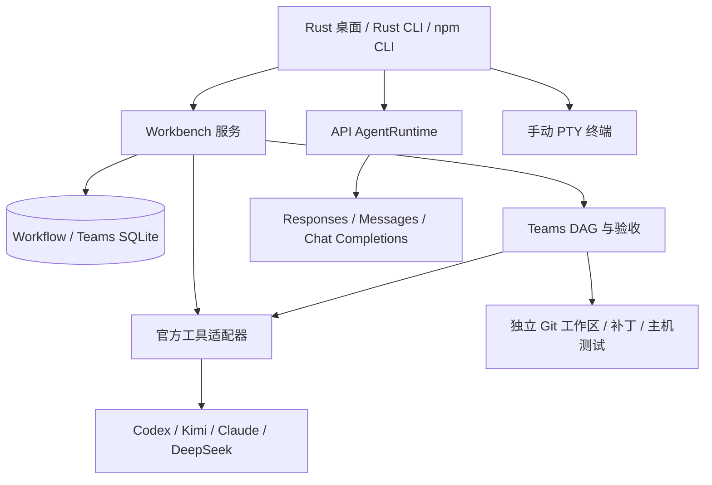

# Wonderland 项目进度、已完成建设步骤与后续实施计划

> 历史快照：本文记录 0.11.0 发布收尾之前的状态，保留当时的 0.10.0 分发信息。随后进行的 0.11.0 发布及开发交接请从 [开发文档索引](README.md) 阅读；不要把本文的旧分发状态当作当前下载版本。

核对日期：2026-09-21（北京时间）。项目目录：`E:/harness/codex/Rust_for_AI-agent`。本报告的代码基线为 `main` 提交 `6383c9a01df9612dce66dcd957f45b7634649a23`，文件说明见 [逐文件职责目录](FILE_CATALOG-2026-09-21.md)。

本报告依据当前源码、Git 提交、版本文档、已有测试记录及本次远端发布状态核对编写。本次主要进行只读核查和文档整理，没有重新运行全部模型实测，也没有将新的规划写成已实现功能。

## 1. 当前已经做到什么程度

**目前已经形成可运行、已有安装包和 CLI 发布记录的 Rust 多模型工作台，以及通过官方工具执行的持久化任务与团队协作基础。核心目标中的“根据最新质量与价格自动分配不同模型，在保证质量的同时降低成本”尚未完成。**

当前最完整的实际证据是：使用已授权 Kimi 订阅，通过官方 Kimi CLI，在独立 JavaScript 项目完成“规划 → 两个实现节点 → 只读评审 → 主机测试 → 验收”的闭环，最终 12 项测试通过。这证明了固定官方执行器的多任务协作链路；尚未证明两个厂商共同完成同一个任务，也尚未证明成本降低或与各官方客户端效率相当。

项目已经越过最初只有聊天窗口和若干工具的阶段，但仍处于产品预览阶段。没有足够依据给出一个可信的“整体完成百分比”：协议适配、产品体验、自动调度和真实模型验证的完成程度差异很大。

### 1.1 代码、发布包与 npm 不是同一个版本状态

| 对象 | 已核对状态 | 应如何理解 |
| --- | --- | --- |
| 本地分支 | `main`，HEAD 为 `6383c9a` | 已按授权合并开发成果，并同步本地 |
| GitHub 默认分支 | `origin/main` 与本地同一提交 | 仓库首页已展示本轮整理后的源码 |
| 合并记录 | [PR #1](https://github.com/Alice-Marx/Rust_for_AI-agent/pull/1) 已合并 | 合并提交包含开发功能和上游参考目录记录 |
| 当前源码版本 | `0.11.0` 开发版 | 含单任务推理档位持久化等新修正，尚未发布 |
| 最新已发布桌面版 | [v0.10.0](https://github.com/Alice-Marx/Rust_for_AI-agent/releases/tag/v0.10.0) | 已有 Windows x64 安装器和便携包 |
| npm 包 | `rust-ai-wonderland-cli` | `next = 0.10.0`；`latest = 0.7.0` |
| 主分支 CI | [运行 35604819755](https://github.com/Alice-Marx/Rust_for_AI-agent/actions/runs/35604819755) 成功 | 不能据此称 0.11.0 已有正式安装包 |

获取当前已发布 npm 预览版需使用 `npm install -g rust-ai-wonderland-cli@next`。不带标签会安装 `latest` 指向的 0.7.0。npm 包是连接 Rust 后端的 Node 客户端，并不包含整个后端或各厂商官方 CLI。

报告编写前，工作区只有用户的 `RESEARCH_PAPER_FRAMEWORK.md` 未跟踪；该文件保持原状，不混入程序发布。本报告及文件目录是本次新增文档，不改变上述源码基线。

### 1.2 主要需求完成矩阵

| 需求 | 当前成果 | 尚缺的关键部分 |
| --- | --- | --- |
| SSE 与桌面渐进输出 | 三类 API 协议与官方工具事件接入；显示正文、推理、工具和权限活动 | 各官方工具流式粒度不同，不能统一承诺逐 token；仍需延迟对照 |
| OpenAI Responses API | 请求、SSE、工具调用、推理封装、缓存键与用量 | 不等于 Codex 原生执行器的全部能力或效率 |
| 沙箱 | Python/Node；Windows AppContainer；Linux/macOS 对应实现路径 | 未统一隔离 Bash、hooks、PTY、MCP、官方 CLI；Unix 强制限制和实测仍有缺口 |
| MCP | stdio、Streamable HTTP、旧式 SSE、资源/提示基础接口、OAuth | 资源模板、部分分页、订阅更新、sampling、elicitation 等尚不完整 |
| Rust 桌面 | Work、Chat、Teams、任务列表/看板、项目、文件、Git、应用、终端及设置 | 插件、定时、远程、PR、网站专用面板及完整 IDE 体验未完成 |
| 会话查询 | JSON 会话正文 + SQLite FTS5 检索；新工作流/团队主存储为 SQLite | 跨任务/产物统一搜索、语义检索尚未完成 |
| 各模型自身官方工具 | Codex、Kimi Python、Claude、DeepSeek 四条受管适配路径 | 真实跨厂商验收、逐模型能力发现及更多应用适配 |
| 订阅与 API | CLIProxyAPI sidecar、账号/登录/模型管理；Kimi 订阅真实使用 | 全厂商账号验证、原生订阅额度读取、统一计费证明 |
| 自动分解任务 | 官方工具规划器生成受校验 DAG；可固定或逐节点指定执行器 | 自动质量/成本选择、自动升级和重规划策略 |
| LiveBench | 每次刷新读取两个官方仓库、固定 SHA、榜单快照与来源证据 | 精确模型/推理配置与榜单条目的可信映射、真正权重计算 |
| 实时价格 | 官方价格抓取、有限格式解析、不可变报价快照 | 所有目标厂商/区域/时段覆盖；订阅和实际账单处理 |
| 成本控制 | 数据层有整数微美元预留账本及并发校验 | 尚未与原生模型计费绑定；带 USD 上限的受管团队当前被阻止 |
| 效率与质量目标 | 独立测试、受保护测试文件、结构化评审和协议回归 | 官方客户端对照、多厂商实验、统计意义上的质量与节省成本证据 |

## 2. 当前系统如何工作

### 2.1 三条执行路径必须区分

| 路径 | 谁负责模型执行循环 | 适用范围与边界 |
| --- | --- | --- |
| API 对话 | Wonderland 自己的 `AgentRuntime`、provider 与 tools | 可接直连 API 或 CLIProxyAPI；并不自动调用该模型的官方开发工具 |
| 受管 Work / Chat / Teams | Codex、Kimi、Claude、DeepSeek 的官方进程 | Wonderland 负责状态、派工、审批、取消、记录和验收；适配器不静默回退到通用 API |
| 内嵌/外部终端 | 用户手动操作的官方 CLI 或自定义程序 | 保留原工具交互和登录；不能据终端屏幕推断准确费用、模型绑定或验收结果 |

这也是后续产品必须继续解释清楚的区别：用户希望“模型配套自身官方工具执行”时，应使用受管官方任务；选择 API 对话并不具备同一项保证。手动终端则适合直接使用官方交互，但不等同于已纳入任务调度。

### 2.2 语言与上游维护方式

后端、工作台、编排和主要适配器用 Rust 编写，桌面为 egui/eframe；npm 客户端是少量 JavaScript，官方程序可以由其自身的 Node、Python 或原生运行时执行。因此“用 Rust 做主程序”与“适配其他语言工具”已经通过进程协议边界实现。

项目文件和测试命令也不局限 Rust：已有真实 JavaScript 示例验证；工作区识别多语言项目，验收采用独立的 `program + args`。这不代表已经为每种语言完成 LSP、调试器、格式化器和完整 IDE 支持。

`anytool/` 保存上游来源与固定版本；16 个 Git 子模块由各自上游维护。Claude 目录是已有的 Gitee 快照，共 6,702 个跟踪文件，更新方式与子模块不同。Wonderland 功能在自己的 `src/` 中开发，不靠持续修改这些上游来维持适配。已安装官方 CLI、只读源码参考、安装包中实际分发的文件是三类不同对象。

## 3. 原先六项重点的实际完成情况

### 3.1 流式输出

Chat Completions、OpenAI Responses、Anthropic Messages 均有 SSE 处理；自有 Agent 通过后端流发送正文、推理、工具状态、审批及最终结果。Rust CLI、npm CLI、桌面接收流式事件；实现会检测异常截断，不能仅因连接结束便报告成功。

官方工具任务保留各协议自己的事件语义。Claude 已处理思考/正文分块与快照去重；DeepSeek ACP 当前发送已提交文本块，不能据此声称 token 级打字流已经普遍实现。首字延迟、总完成时间和长期会话稳定性尚缺统一对照测试。

### 3.2 Responses 与模型适配

`responses.rs` 已实现 `/v1/responses`，包括工具调用、推理摘要、加密推理封装回传、缓存键、usage 和流式累积。`anthropic.rs` 处理 Messages 的 thinking、签名与缓存断点；`model_profile.rs` 按模型族组织参数和工具偏好。

`router.rs` 是选择网络协议的模块，不是按价格与质量选模型的系统。在 API 模式下，某些配置可使用 Chat Completions 协议回退；这与受管官方执行器严格绑定、无通用 API 回退是不同逻辑。

### 3.3 沙箱

SandboxRun 已支持 Python 和 Node。Windows 实现使用独立 AppContainer、目录 ACL、无网络 capability、Job Object 和有界进程清理；Linux 使用 bubblewrap，macOS 使用 sandbox-exec，找不到必需隔离设施时拒绝执行。

Windows 有真实隔离回归证据；Unix 存在实现与编译检查，但不能宣称已经取得同等全面的真实隔离验证。Unix 配置中的内存/进程限制字段也不等于所有限制均已由操作系统执行。项目没有 Landlock 实现。

该能力覆盖专门的 SandboxRun。Bash、hooks、MCP 服务、PTY 与官方工具各有自己的执行路径。Git worktree 隔离用于保护改动和集成，也不是操作系统安全沙箱。

### 3.4 MCP

已有 stdio、Streamable HTTP 和旧式 HTTP+SSE 三类传输，工具发现与注册、资源 list/read、提示 list/get；OAuth 包含发现、PKCE、回调 state 校验、token 刷新及重载。凭据由专用存储保护。

仍需补足资源模板、资源/提示部分分页、订阅与通知更新、服务端 sampling/elicitation 等，并扩大真实服务器兼容性测试。API Agent 的 MCP 注册不会自动共享给所有官方 CLI；部分受管适配为了确保模型和工具边界，目前明确关闭了原生 MCP/插件。

### 3.5 桌面界面

已经提供深色主题、薄荷色强调、中文字体、自绘向量图标和紧凑窗口布局；这些是代码内图标与已有资源，并未宣称使用生成式图片完成整套品牌设计。

现在可使用的界面包括：

- Work/Chat 新建任务、列表/看板、详情、事件、输出、审批和用户问题。
- Teams 新建与详情、节点状态、执行器绑定及验收记录。
- 应用目录、安装探测、官方 CLI 终端入口；项目文件树、文本编辑、Git 状态与 diff。
- 内嵌 PTY/ConPTY、系统终端、账号/API 连接、模型档案、推理选择、MCP 和会话搜索。

常规窗口和 940×620 窗口已做渲染检查。截图中的展示数据不能用来证明模型真的运行成功。界面已经具备工作台形态，但距离成熟应用仍缺完整的错误恢复、统一待处理中心、无障碍和键盘体验测试、长时间运行体验，以及后文列出的专用功能面板。当前 Chat 也不应被理解为已经具有跨所有厂商的原生会话恢复、分叉和无损迁移。

### 3.6 会话存储与检索

旧 API 会话正文仍由 JSON 保存，SQLite FTS5 trigram 提供可重建的索引，支持关键词、片段和用户筛选。新版 Workflow 和 Teams 则使用 SQLite 作为状态与事件的主要存储。

已完成“有数据库查询层”，尚未完成“所有业务数据都迁入统一数据库”或“向量语义检索”。长期记忆目前也是 JSON 与简单匹配排序。

## 4. 官方应用、订阅与协作分别验证到了哪一级

### 4.1 四个受管执行器

| 工具 | 已实现 | 当前真实证据 | 不能声称完成的部分 |
| --- | --- | --- | --- |
| Codex | app-server，模型/provider 校验，任务与工具事件、审批、问题、取消，传入请求推理档位 | 握手与协议验证；之前真实模型调用曾失败 | 未有成功的完整 Codex 团队实测；推理有效值尚无完整回读 |
| Kimi Python CLI | Wire，固定精确模型，审批、事件、用量、取消 | 官方 `kimi-cli==1.50.0`、`kimi-for-coding`、真实订阅团队及 12 项主机测试 | 尚不是双厂商合作；没有通用受管推理档位开关 |
| Claude Code | 官方原生 npm 2.1.193，双向 stream-json；有效模型/effort 校验、安全模式与工具限制、一次性审批/提问、流去重 | 真实官方 CLI 离线初始化；本地合成 Anthropic SSE 完整协议循环 | 未调用真实 Claude 模型；不是官方全部插件/子代理功能的无损接入 |
| DeepSeek Harness | 官方 npm `@deepseek-ai/dsh@0.1.6-alpha.2`，ACP；隔离 profile、精确模型、`off/low/high/max`、一次性权限、取消 | 真实官方程序无密钥 initialize / 建会话 / 配模型和 effort / 关闭 | 未发送真实推理；使用 API key，不宣称订阅 OAuth；上下文占用不是计费 token |

四个适配器当前均明确 `resume=false`、`fork=false`。服务崩溃后的记录会按中断处理；复制新任务或重新开始不是原生恢复。安装探测提供版本、路径和文件摘要，但摘要不是发行商签名，找到程序也不代表账号已登录或模型可用。

受管 Chat 由后端强制只读。普通 Work/Chat 执行结束进入 `Verifying`，需要提交验收说明才成为成功；Teams 子任务不能绕过父任务单独验收。关闭或断开桌面不会取消服务拥有的任务，但服务重启会把未结束任务标为中断，不自动重放原操作。

Kimi Code Node、MiniMax、MiMo、ZCode 等提供目录或直接使用入口，不能与已完成上述结构化适配混为一谈。Grok、pi、OpenCode、Kiro、Hermes 的上游仓库收录也不等于产品已支持受管调度。

### 4.2 CLIProxyAPI 的真实集成方式

当前集成原版 CLIProxyAPI 7.3.7 sidecar，包括定位/获取/校验、生成配置、本地密钥、启动/健康检查/停止，以及登录、账号、模型和管理 API 的对接；Windows 包含相应 sidecar 和许可证说明。Kimi 登录及订阅模型调用已有真实记录。

它没有被完整重写为 Rust，也不能声称上游所有管理功能、提供商和账号组合都已逐一在 GUI 验证。Wonderland 主程序保持 Rust，代理由原项目进程承担，便于跟随上游。

官方受管 CLI 使用各自原生登录配置；代理账号登录与官方 CLI 登录不是同一账户状态。API 标价也不能直接代表订阅调用的边际成本、剩余额度或实际账单。

### 4.3 Teams 已有的完整链路

1. 服务保存目标、目录、验收命令、固定或逐节点执行器绑定、并发/次数/时限。
2. 未提供节点时，通过选定官方工具进行规划，解析结构化计划并校验 DAG、节点和依赖。
3. 为运行和每个实现 attempt 创建独立 Git 工作区，固定源提交、声明写入范围并保护已有测试。
4. 调度就绪节点，在界限内并行；各节点继续使用自身绑定的官方工具。
5. 记录工具请求、权限、输出和终态；执行器结束并不立即等于验收通过。
6. 对提交和补丁进行范围、散列、篡改与冲突检查，再串行集成。
7. 只读评审必须返回结构化 `accepted/findings/summary`，有阻断发现不能靠一段肯定文字通过。
8. 主机按明确 argv 执行既有测试等检查；验收与被测试 revision 对应后才确认成功。
9. 状态、事件、节点和 attempt 保存在 SQLite；服务拥有执行进程，界面是控制与观察客户端。

独立工作区中的成果尚不等于自动修改原项目或已创建 PR。已有实测保留原始 checkout、HEAD 和测试内容不变。

当前 Teams 要求输入是干净的 Git 仓库根目录；不能自动把已有未提交改动搬入团队工作区。默认并发 2、每节点最多 2 次尝试，配置上限分别为 8 并发、24 节点、每节点 5 次尝试。Assigned 需要明确节点、各节点绑定和候选清单；不存在失败后自行换模型的隐式行为。验收命令在创建时由用户声明，运行后还检查被测试 revision 与工作区没有漂移。

### 4.4 自动选模与预算为何还不能使用

当前 `team_service.rs::execute_team` 对 `Automatic` 的处理是：并行在线刷新 LiveBench 与价格，记录 `routing_epoch`，随后明确转为 `Blocked`。即使两类数据刷新成功，现版本也不会自动选出模型继续运行。

原因是尚未核验完整的账号计费渠道、订阅额度以及精确模型/推理配置与 benchmark 的映射。`Fixed` 或 `Assigned` 设置 `budget_usd` 时也会在派工前被阻止；数据层的预算预留机制还不能约束官方账号的实际消耗。

因此，现在可运行的是**不设置 USD 硬上限的固定/指定协作**，不是已启用的成本优化系统。论文设想中的 QCG、AMO、DAG 分配优化和“降低成本 40–60%”都不能作为已完成结果；目前没有这类实验结论。

## 5. 已完成的规划与实际编写步骤

以下按可追踪的建设阶段整理。步骤对应已有提交和源码，不是把未来方案倒写成实施记录。

### 阶段一：建立 Rust 后端、客户端和发布骨架（2026-09-16）

主要提交：`25330b0`、`1450ee0`、`cbd3a3c`、`b350343`。

1. 先建立模型、工具、记忆、会话、规划和 AgentRuntime 的 Rust 接口，形成可扩展 HTTP 后端。
2. 加入 CLIProxyAPI 客户端、登录与账号管理，使订阅代理连接可配置。
3. 增加 Rust CLI 和 egui 桌面，让同一后端可以从不同入口使用。
4. 建立 Windows 安装器、便携目录和 npm 客户端发布结构。

成果是可运行的工程骨架。此时的启发式规划、示例协作和费用 CRUD 不是后来的官方工具 Teams，也不是成本优化算法。

### 阶段二：补齐自有 Agent 的工具能力（2026-09-17 至 09-18）

主要提交：`459760b`、`78bd680`；对应早期工具扩展和 0.3.0。

1. 加入 TodoWrite、WebFetch、Task，把待办、网页读取和命名子任务接入工具注册与权限管线。
2. 补充 hooks、后台 Bash、输出读取/停止、apply_patch、NotebookEdit 和计划权限模式。
3. 读取 Markdown 子 Agent、技能和项目说明，加入白名单及上下文限制。
4. 为文件编辑、权限、超时和工具解析增加回归。

成果是自有 API Agent 的执行能力增强。后台进程不等于定时任务；Markdown skills 不等于插件市场。

### 阶段三：模型协议、流式、MCP 和沙箱（2026-09-18，0.4–0.6）

主要提交：`ecaf50a`、`bc1351c`、`9c35fd1`、`c0a92df`。

1. 建立厂商预设和模型档案，将协议/推理/上下文差异从通用循环中分离。
2. 加入原生 Anthropic Messages 和 OpenAI Responses；实现正文、推理、工具、缓存及 usage 的协议转换。
3. 接通后端、CLI、桌面 SSE，处理不完整流与多块内容，避免必须等待完整长回答。
4. 扩展 MCP 的 HTTP/SSE、资源、提示和 OAuth，并连接私密凭据存储。
5. 把专用代码执行从原型提升为 Python/Node 与平台隔离实现；补充 JSON 会话的 SQLite 查询索引。
6. 调整桌面主题、字体、图标、连接/模型/账号面板和发布资源；修复 Windows 资源构建在 Unix 的条件编译。

成果是原先六项需求的主要技术路径建立，并有 0.6.0 发布/验证记录；安全覆盖和完整 MCP 仍有限制。

### 阶段四：形成项目工作台和官方 CLI 使用入口（2026-09-18 至 09-19，0.7）

主要提交：`1138bf9`、`4b94d02`、`7afdcc9`。

1. 建立应用目录、来源信息和跨平台程序发现，区分官方发布入口、本地构建和未安装状态。
2. 用 portable-pty/ConPTY 与 vt100 实现应用内终端，支持输入、输出、缩放、选择和进程清理。
3. 加入项目文件树、带修订检查的文本编辑、Git 状态和 diff。
4. 接入在项目目录打开 CLI、外部终端和文件夹的操作。
5. 修复 Windows 不同区域设置下的 Unicode 终端编码，检查 Unix 编译及核心终端行为，再打包安装。

成果是用户可以在产品内操作项目和原工具。此时的 CLI 入口仍不能替代结构化托管任务。

### 阶段五：整理上游和制定两份正式建设方案（09-19 至 09-21）

相关提交：`97a196b`、`c6b363a`、`864f897`、`22ad26f`、`eb3c12b`。

1. 将上游来源整理到 `anytool/`，记录子模块固定提交和 Claude 快照来源，保留已有本地参考目录。
2. 编写 [多模型自主协作方案](MULTI_MODEL_ORCHESTRATION_PLAN.md)：定义官方工具绑定、任务合同、DAG、证据、预算、验收和实验方法。
3. 编写 [桌面产品方案](DESKTOP_PRODUCT_PLAN.md)：定义 Work/Chat、应用中心、项目、看板、插件、定时、远程、PR 和网站的产品范围。
4. 明确“自动协作”“指定 AI 完整执行”“自定义团队”“直接使用应用”是不同执行方式。

这些方案已完成编写，但不是逐项实现证明。方案头部保留编写时的状态；判断当前进度应结合本报告，而不是把整份愿景算作交付。

### 阶段六：持久化 Work/Chat 与 LiveBench 证据（2026-09-21，0.8）

主要提交：`04abea3`。

1. 先定义 Workflow 创建/记录/状态迁移和有序事件，再用 SQLite 保证任务可以跨客户端读取。
2. 将进程所有权放入 Workbench 服务，处理重复启动、审批、取消、退出与中断记录。
3. 接入 Codex app-server 与 Kimi Wire；模型/工具绑定由服务和适配器检查，避免无声替换。
4. 新增 Work/Chat 列表、看板、创建和详情；Rust/npm CLI 使用同一任务 API。
5. 接入 LiveBench 两个官方仓库，在线解析当前提交与已发布榜单，保存时间、SHA、原始数据摘要和不可变快照。

成果是可持续记录的官方工具任务基础。获取榜单数据完成，自动权重决策未完成。

### 阶段七：Teams 调度、隔离集成与真实 Kimi 验收（2026-09-21，0.9）

主要提交：`513505c`。

1. 先建立团队、节点、attempt、事件和预算预留的数据合同，验证 DAG 与绑定。
2. 编写官方工具规划调用和结构化结果解析，支持固定策略与逐节点指定。
3. 建立独立 Git worktree、测试保护、写范围和补丁身份校验，串行集成并检测冲突。
4. 加入只读结构化评审和显式主机测试；将“执行结束”与“验收成功”分开。
5. 实现官方 API 价格来源快照；不明计费/身份会阻止自动派工。
6. 加入 Teams GUI、Rust/npm 命令，使用独立 JavaScript 示例进行 Kimi 真实订阅验证。
7. 根据实测修正 Windows Git 路径、换行造成的错误 dirty 判断和评审通过条件，最终通过 12 项验收。

成果是固定官方执行器协作闭环，不是已经实现质量/价格自适应路由。

### 阶段八：参考 CodexHost 扩展 Claude/DeepSeek（2026-09-21，0.10）

主要提交：`61819b1`。参考记录见 [CODEX_HOST_REFERENCE.md](CODEX_HOST_REFERENCE.md)，已审阅上游提交 `fb36f2dfee08cb8db68d3eee362f02a7ca61d3ae`。

1. 借鉴 Host/Native session 分层、能力报告、请求配置与有效配置区分、版本协议隔离、用量分类与契约测试。
2. 编写自有 Rust Claude stream-json 与 DeepSeek ACP 适配器，限制已验证官方发行版本。
3. 落实精确模型/effort、一次性审批、活动工具生命周期、取消及有界进程清理。
4. Claude 保存脱敏官方协议轨迹；DeepSeek 用真实官方程序完成无密钥握手和设置往返。
5. 增加应用版本/路径/指纹诊断，接入桌面和两个 CLI。
6. 完成回归、release 构建、安装与包内容检查，发布 GitHub v0.10.0 和 npm next。

没有复制 CodexHost 的整套桌面注入、renderer、所有适配器或资源；也没有用离线协议测试代替真实付费模型验证。

### 阶段九：本地/远端整理、推理档位持久化与合入 main（2026-09-21，0.11 开发）

主要提交：`22927ce`、`ab191d7`、`385dcc9`、`6383c9a`。

1. 核对远端 main 的上游目录改动与开发分支功能提交，保留双方历史后合并。
2. 发现 Work/Chat 创建和记录缺少推理档位；把 `reasoning_effort` 加入请求、数据库、记录和原生执行请求。
3. 编写 SQLite v1→v2 事务迁移；历史未指定的档位保持 `NULL`，不猜测补成默认值。
4. 统一 Work/Chat 与 Teams 子任务的配置来源；启动读取持久化记录，校验 owner、工具、模型和 effort，不允许启动参数覆盖。
5. 桌面新增创建时选择与复制保留，切换应用时清空不相容模型/档位；能力选项以所连服务为准，未知能力不宽松回退。
6. Rust/npm CLI 同步创建参数，并在后端拒绝启动时临时变更。
7. 完成回归及真实 v1 数据副本迁移检查，更新文档与目录说明；PR 合并后本地 main 同步。

成果已进入 GitHub main，但没有构建发布 0.11.0 安装器或 npm 版本。当前 UI 展示的是“请求档位”，不能据此声称每个模型的实际推理强度都已回读确认。

## 6. 测试、安装与真实任务证据

### 6.1 当前源码回归

| 验证项目 | 已有结果 | 范围说明 |
| --- | --- | --- |
| Windows Rust | 404 库 + 3 Rust CLI + 18 桌面 + 7 协议集成，共 432 项通过 | 7 项需要外部条件的测试默认忽略，不能算全部外部能力均通过 |
| npm CLI | 14 项通过 | SSE、工作流、Teams/价格和错误传播等 |
| 格式检查 | 通过 | `cargo fmt --all -- --check` |
| Linux/macOS | 全目标编译 + 部分核心模块测试通过 | 不是与 Windows 完全相同的全量测试，也不是原生安装包验收 |
| 主分支 CI | 成功，见本报告前述链接 | CI 不能证明账号、付费推理或产品全部交互 |
| 桌面布局 | 常规与 940×620 窗口检查 | 是渲染检查，未做全面可用性/无障碍研究 |

对应本地主要检查命令为 `cargo test --locked --all-targets --features ui-snapshots`、`cargo fmt --all -- --check` 和 `npm test --prefix packaging/npm/wonderland-cli`。本报告引用已有结果，没有在文档整理时重复运行整套测试。

### 6.2 当前源码的数据迁移验证

用 0.10.0 独立测试数据的副本运行新后端：

- 原有 5 个成功工作流的 ID、模型、状态、输出均保持。
- Rust CLI 创建 Claude `high` 草稿，npm CLI 创建 DeepSeek `off` 草稿；旧客户端省略参数得到 `null`。
- 服务重启后档位保持；启动时覆盖配置被拒绝；Kimi 不支持的 `high` 被拒绝。
- 未调用模型，原始数据库内容未更改。

本地证据：`E:/harness/toolchains/wonderland-reconcile-smoke.json`。工作流 schema 已升为 v2，0.10.0 程序会拒绝该新版库；后续发布需要明确备份/回退流程，不能用旧程序直接降级读取。

### 6.3 真实 Kimi 项目协作

详细记录：[VALIDATION-0.9.0.md](VALIDATION-0.9.0.md)。Team 为 `team_7aa249db2ff1465891f2de61f2323e86`，被测试提交为 `b5139d836965408c5a7b60a6f2ab212903b353fd`。

示例是发票金额计算与 CSV 转义；两个实现节点仅修改 `src/money.js` 和 `src/csv.js`。既有测试的 Git blob 没有变化，原始 checkout 保持不变。主机 `node --test` 和服务外复核均为 12 通过。此前一次探索运行因时限失败，已如实记录失败，不混入成功证据。

### 6.4 LiveBench 与价格实测的时间边界

历史在线验证记录为 2026-09-21：榜单公布版本 2026-06-25、58 个模型；`new-livebench` 提交 `bc7d9c1787d85ce521304fc0472fd8c25b117f75`，`LiveBench` 提交 `1263ee472f4b9ac3833c0d2f6ad50dd3747fd1df`。价格取得 41 条可匹配 API 报价，OpenAI/Kimi 解析成功，Anthropic/DeepSeek 未核验的 ID 或条件保持阻塞。

这些是当时的快照，不是本报告对当前市场价格的推荐。重新计算权重时必须重新在线刷新，不能把本段的日期、分数或价格数目写死进路由逻辑。

### 6.5 0.10.0 发布验收

Windows x64 release 构建通过；当前用户安装器返回 0，安装后的后端、桌面、Rust CLI 与打包二进制散列一致。便携 ZIP 35 个条目、npm tarball 5 个条目经过检查，没有包含账号凭据或测试数据库。

安装器 SHA-256：`e9875bcc6352c9569862041bab67dd8ee3b7791de927ecf40a4d8b11a90829c8`。便携包 SHA-256：`d96aa2efd0e73a493a4fd45246a9190a08f2201d04c2e043852dc55e43eb73da`。

已发布产物没有代码签名；Linux/macOS 尚未交付同等安装包。GitHub 与 npm 发布成功不等于开发中的 0.11.0 已发布。

## 7. 文件应当怎样阅读，哪些名称容易误解

本次基线包含 130 个主项目维护文件，其中 74 个 Rust 文件（含构建脚本与 Rust 测试）。逐项职责、调用关系和限制见 [FILE_CATALOG-2026-09-21.md](FILE_CATALOG-2026-09-21.md)。6,702 个 Claude 来源快照文件和 16 个上游子模块另列来源，不计作 Wonderland 自研成果。

建议阅读顺序：

1. `Cargo.toml`、`src/main.rs`、`src/lib.rs`：了解依赖、启动和模块组织。
2. `workflow.rs`、`workbench_service.rs`：了解任务状态、存储和进程所有权。
3. `native_executor.rs` 及其子模块：了解官方工具如何真正被调用。
4. `team_store.rs`、`team_service.rs`、`team_workspace.rs`、`team_checks.rs`：了解真实团队协作。
5. `model_intelligence.rs`、`pricing.rs`：了解榜单/价格证据与尚未跨过的自动派工条件。
6. `src/bin/desktop/`、`desktop_terminal.rs`、`desktop_workspace.rs`：了解界面和项目操作。
7. `agent.rs`、三类 provider、`tools/`、MCP 与 sandbox：了解另一条自有 API Agent 路径。

特别需要避免的误读：

| 文件/概念 | 实际情况 |
| --- | --- |
| `planning.rs` | 按标点分句的启发式规划和简单反思，不是 Teams 的 LLM DAG 规划器 |
| `collaboration.rs` | 旧命名 worker 注册表，Research/Expense 含固定话术示例，不是跨厂商调度核心 |
| `evaluation.rs` | 规则评分和 JSON 报告，不是经过校准的质量预测器 |
| `expenses.rs` | 内存报销账目 CRUD 示例，不是模型成本账本 |
| `router.rs` | API 协议路由，不是 LiveBench/成本权重路由 |
| `tools/background.rs` | 后台 shell 任务，不是定时任务系统 |
| `skills.rs` | Markdown 指南加载，不是可安装插件平台 |
| Git worktree | 改动和集成隔离，不是系统权限隔离 |

## 8. 接下来要完成的建设顺序与编写步骤

以下是后续计划，不计入完成项。为避免继续扩大功能表面而核心链路不完整，先补“身份/真实验证/计费/自动派工”，同时推进桌面体验；新模块名是建议名，不表示文件已经存在。

### P0-A：把四个官方执行器做成可核验、可持续升级的适配器

实施步骤：

1. 从 `native_executor`、`app_diagnostics` 拆清程序身份、协议版本、账号能力、逐模型能力、请求配置和有效配置。
2. 按每个官方版本建立模型目录和 effort 可选项，支持未知状态；不用厂商统一列表冒充每个模型都支持。
3. 补 Codex 有效推理档位回读，处理别名、实际模型偏移及工具内部辅助模型；不能核验的配置不进入自动候选。
4. 按已获账号范围完成 Codex、Claude、DeepSeek 真实任务；缺必要账号时仅明确对应阻塞，不把离线轨迹充当推理成功。
5. 用独立示例项目完成至少两个厂商参与的 Assigned 团队：固定输入、原有测试、隔离 worktree、独立评审和主机验收。
6. 保存脱敏协议样本，建立官方版本升级的契约回归；不修改上游工具代码来掩盖接口不兼容。

验收：每次实际执行都可追溯工具版本、模型、请求与有效配置、账号渠道、节点和结果；跨厂商案例测试通过且既有测试未被削弱。四个适配器的“已支持”“已真实验证”分别显示。

### P0-B：补齐价格、订阅额度和账本语义

实施步骤：

1. 扩展 `pricing.rs` 的 Anthropic/DeepSeek 精确型号、区域、币种、时段、长上下文、缓存与其它费用条件；官方页面格式变化时拒绝猜测。
2. 为各适配器增加账号/usage 能力报告，分别表达 API token、实际金额、原生 credits、订阅窗口/额度、不可得字段。
3. 建立模型 ID、计费型号、LiveBench 条目的版本化映射，记录证据而非模糊字符串相似度。
4. 将团队预算预留与 attempt 派工/结算/取消接通，保证并发预留和重复结果幂等；保留失败尝试的消耗。
5. 定义进行中请求、厂商延迟计费及停止后的费用风险。没有可证实的成本上界时，界面只能承诺估算/软限制，不能标为硬预算。
6. 把订阅月费分摊、剩余额度和增量付费分别处理，不把订阅可调用等价于免费无限调用。

验收：同一条调用可以追溯当前适用价格或明确未知原因；账户额度未知时不会参与虚假的最低价排序；支持的预算模式具有对应故障与并发测试。

### P0-C：真正开启动态质量/成本自动调度

实施步骤：

1. 建立显式 `routing epoch` 合同：每次重新计算权重都在线刷新 LiveBench 两仓库和官方价格，保存 SHA、时间、发布版本、来源 hash。
2. 先筛选官方工具、账号、精确模型、任务能力、质量证据和预算均合格的候选；失败时保留历史展示但不能借历史数据授权新决策。
3. 按任务类型使用 LiveBench 分类信息与独立样本校准质量预测；榜单分数只能作为先验，不直接当作某项目的成功概率。
4. 先实现可解释的质量约束成本选择基线，再与多目标效用策略比较；定义延迟、失败重试、规划、评审和集成成本。
5. 接入 `team_service` 的规划/节点派工，每个节点保存候选、排除原因、证据版本和选择理由。
6. 补有界返修、升级和重新规划；发生新权重决策时创建新 epoch，固定节点不能被自动覆盖。
7. 在数据刷新失败、价格过期、别名漂移、额度不足、模型不可用等故障中验证阻塞或按合同重新选择。

验收：`Automatic` 在证据完整时确实能完成真实任务；证据不足时能解释阻塞；用户能追溯“为什么这个节点用了这个模型及官方工具”。随后通过实验验证成本与质量，不预先承诺节省比例。

### P1-A：恢复、重试、分叉和长任务稳定性

1. 为适配器增加原生 session/turn/checkpoint、协议 generation 与事件游标合同。
2. 原生恢复时核对会话、工具、模型、配置与工作区；分叉必须调用上游真实支持的能力。
3. 区分 GUI 关闭、服务正常关闭、服务崩溃、系统重启，恢复待处理审批时使旧请求失效。
4. 验证断线重连、重复事件、超时、子进程清理、长输出、磁盘满和数据库冲突。

验收：不存在“实际重新开始却显示恢复”的情况；旧审批和旧进程结果不能作用到新任务；每个恢复后的任务仍能关联被测试产物。

### P1-B：继续建设桌面产品

| 产品功能 | 具体编写步骤 | 完成标准 |
| --- | --- | --- |
| Work/Chat 日常体验 | 统一待处理中心、跨页面状态、错误恢复、快捷键、搜索、输出/产物跳转；梳理窄窗口和长列表 | 从建任务到审批、检查、验收、再次打开可顺畅完成 |
| Teams 计划编辑与交付 | 用表单/依赖图编辑节点、执行器和写范围，保留 JSON 导入导出；加入 integration 成果审阅、导出补丁和显式应用流程 | 用户无需主要依赖手写 JSON；应用成果前可核对源 revision 和冲突 |
| 应用中心 | 逐应用显示安装/认证/模型/能力；登录、诊断、版本管理；将结构化会话和手动 CLI 入口区分 | 不再以“找到 EXE”冒充可执行任务；未知状态可解释 |
| MiniMax/MiMo/Kimi Node/ZCode 等 | 分别核对官方协议与来源，增加适配器、版本合同及真实任务回归 | 每个应用独立验收后进入受管候选；保持上游不改 |
| 插件 | Rust 主机插件合同/manifest/API 版本、权限、安装/更新/禁用/卸载、隔离进程 | 至少一个示例插件贯穿完整生命周期，版本不兼容可拒绝 |
| 定时任务 | 持久化计划、时区、错过触发、并发去重、权限与预算、运行历史和通知 | 重启不重复派工；需要新批准时不会自动放行 |
| 远程任务控制 | 认证配对、传输保护、远端能力、断线重连、远端路径/产物、取消和撤销 | 从另一设备可靠观察/控制；不混同任意桌面鼠标键盘远控 |
| 连接应用 | 为 GitHub、文件/文档等建立授权范围和撤销、查询/写入能力 | 能力/凭据边界明确；外部写入有任务授权和记录 |
| Pull Request | 仓库与分支、diff、检查状态、创建草稿、评审定位与合并操作 | 可从已验收产物生成可审阅 PR，合并与发布按授权处理 |
| 网站 | 本地预览服务、浏览器面板、端口/生命周期、部署目标和预览地址 | 能展示实际项目、保存运行记录，预览与正式部署区分 |
| 项目与多语言 | 工作区配置、任务入口、测试/格式化命令、文件冲突提示；逐步加入 LSP 等 | 至少在 Rust/JS/Python 项目完成相同关键流程 |

桌面统一信息结构和视觉规范应持续迭代，不用增加一排暂不可用的导航项代替功能。已有 egui 界面可以继续演进；外部桌面 EXE 无稳定嵌入接口时应明确外部打开，不承诺强行嵌入所有应用窗口。

### P1-C：安全、MCP 和可维护性补齐

1. 建立每条执行路径的隔离能力矩阵，实际运行 Linux/macOS 沙箱用例；补足缺失资源限制及环境探测。
2. 补 MCP 缺失能力与更多真实服务兼容回归；明确受管官方 CLI 和 API Agent 的 MCP 配置边界。
3. 清理旧示例模块、过强的“等价官方”注释和模型情报中遗留 pricing 占位状态，避免误导后续开发。
4. 逐步拆分较大的 API、native executor、桌面和团队模块，保持契约测试覆盖；改进日志脱敏、诊断导出和故障定位。
5. 完善凭据说明：Windows DPAPI 加密，Unix 依靠受限文件权限，不能统一描述为所有平台都加密。

### P2：研究实验与可对外发布的质量结论

1. 建立独立、固定版本且不被模型改写的任务集，包含多个语言、难度和工具负载。
2. 设置对照：同一模型直接使用官方工具、Wonderland 固定模型、手动 Assigned、真正 Automatic。
3. 记录质量/测试通过率、返修次数、首输出与总耗时、全部阶段费用、订阅消耗与人工介入。
4. 进行重复实验和统计区间，控制工具版本、网络、缓存、账号套餐和测试基线。
5. 进行消融：去掉榜单刷新、任务分类、独立评审等，检验各机制真实贡献。
6. 将论文中的算法、工程限制与实验结果逐项对应；没有实验时保留为假设，不写成完成结论。

验收：能用可复现数据回答“在什么任务和账户条件下，更省多少钱、质量是否下降、耗时怎样变化”，而不是仅展示调用了很多模型。

### 发布收尾：0.11.0 与之后的版本

0.11.0 当前代码已经通过回归，发布工作仍包括：冻结范围与版本记录、迁移/备份说明、release 构建、安装器和便携包生成、升级安装与旧数据检查、npm 包清单检查、散列、GitHub/npm 发布及从分发渠道复装验证。

后续还要明确 npm `next/latest` 策略、Windows 签名、Linux/macOS 分发、官方工具兼容矩阵及更新回退机制。不能把“合入 main”作为安装包与 npm 已同步更新的证据。

## 9. 下一轮的建议交付包

建议先以三项可验收结果推进，而不是同时宣布所有桌面面板和所有厂商都完成：

1. **可追溯的真实跨厂商示例**：完成官方工具有效身份/模型设置核验，以及一个两厂商合作的独立项目。
2. **可解释的自动调度首版**：补齐账号/价格/榜单映射，至少对有真实证据的候选开启 Automatic，并保留失败时的阻塞行为。
3. **配套桌面与发布**：在界面呈现任务、审批、候选排除原因、费用未知项和验收产物，完成相应版本安装与 npm 更新。

目前最有价值的成果是已建立真实官方工具执行、任务持久化、隔离集成和独立验收的基础。后续的关键是让“选择哪个模型、为什么选择、实际花费、是否达到质量要求”同样具备可验证证据。
