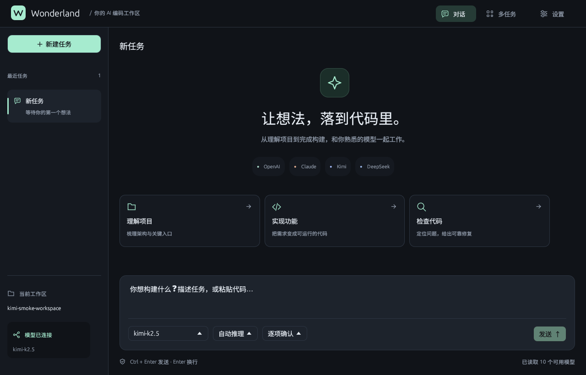
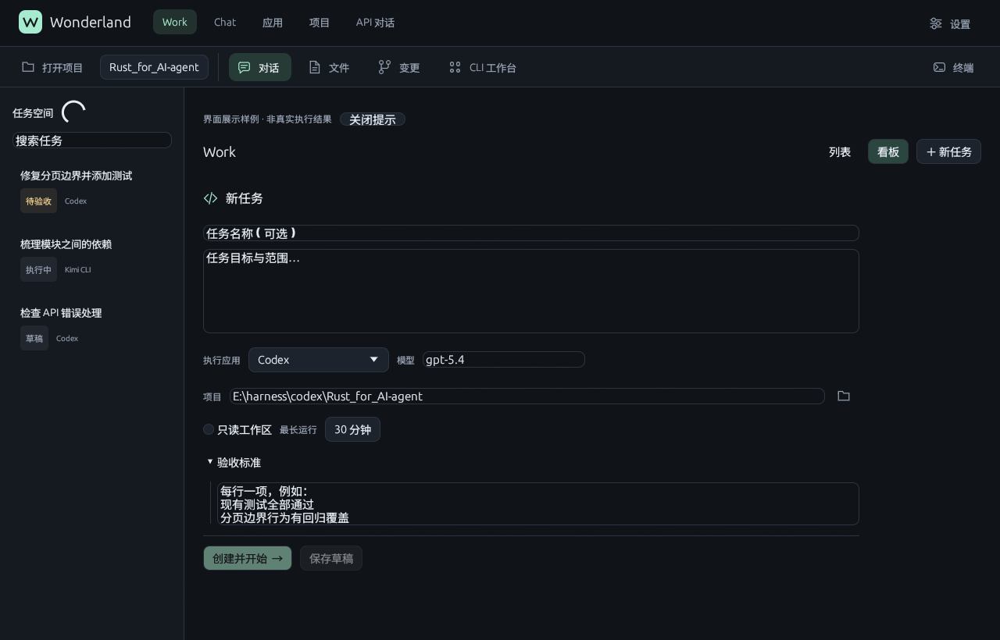
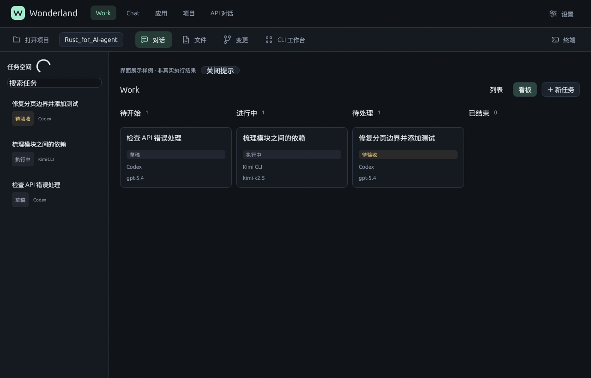
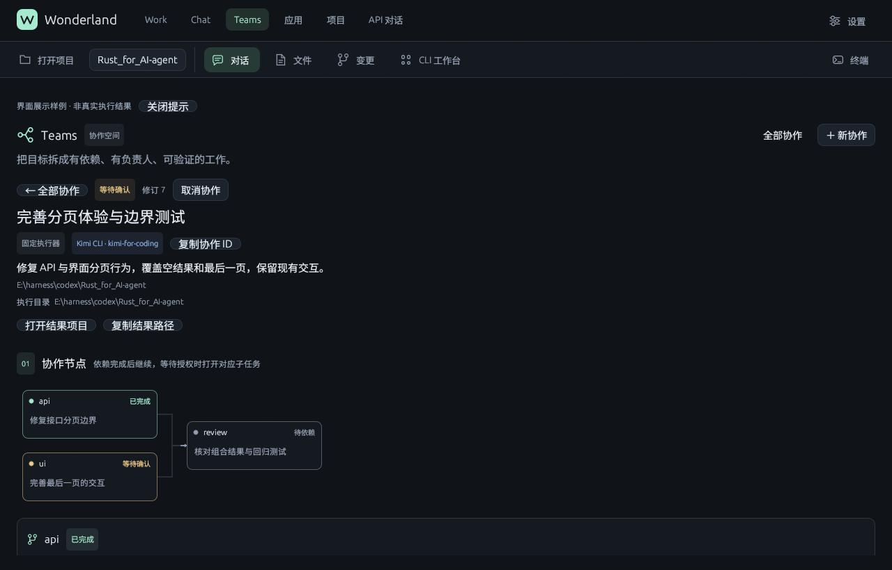
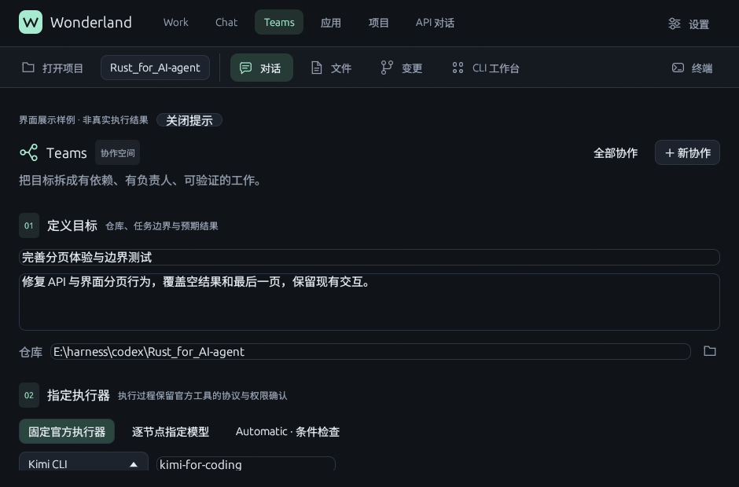
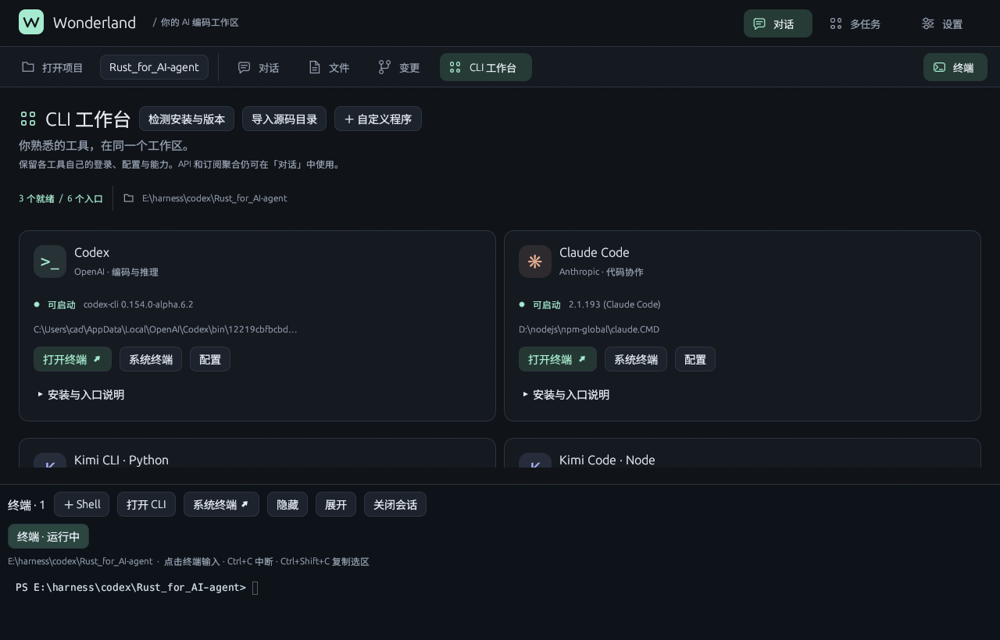

# Wonderland 图文使用说明

面向第一次使用 Wonderland 的用户。请按顺序阅读；每一步都配了界面截图或具体命令。
本说明对应 **0.11.1** 版本安装包（2026-09-23 修复版：安装可选目录、启动有状态提示）。

---

## 1. 下载与安装

**下载**：打开 [GitHub 发布页](https://github.com/Alice-Marx/Rust_for_AI-agent/releases/tag/v0.11.1)，下载 `Wonderland-Setup-0.11.1-x64.exe`（也可用免安装的 `Wonderland-0.11.1-windows-x64.zip`，解压后直接运行里面的 `Start-Wonderland.ps1`，然后跳到第 3 节）。

**安装**（双击安装器后共 4 步左右）：

1. 欢迎页 → 点「下一步」。
2. **安装目录页**：默认在 C 盘；**不想占 C 盘就点「浏览」换到其他盘**（例如 `F:\Wonderland`）。
3. **数据目录页**（本版新增）：任务数据、数据库和日志的存放位置。
   - 你把安装目录选到了非 C 盘时，这里会自动跟着变成该盘（如 `F:\WonderlandData`），直接「下一步」即可；
   - 也可以点「浏览」放到任意位置；
   - **卸载程序不会删除数据目录**，你的任务记录会保留。
4. 「安装」→ 完成页保持勾选「运行 Wonderland」→ 点「完成」会自动启动。

> 校验（可选）：安装器 SHA-256 为 `c890435c…722229`，与发布页 `SHA256SUMS.txt` 一致。

## 2. 启动时会发生什么

双击桌面或开始菜单的「Wonderland」图标后，会先出现一个**黑色终端窗口**，逐行显示中文状态，这是正常的：

```text
Wonderland 正在启动...
数据目录: F:\WonderlandData
正在启动本地服务（127.0.0.1:8080）...
正在打开桌面窗口...
完成。桌面窗口应已打开；若没有出现，请直接运行安装目录下的 wonderland-desktop.exe。
```

约 2 秒后终端自动关闭，**桌面主窗口**弹出。以后再次启动时，已运行的本地服务会被直接复用（显示「本地服务已在运行」）。

**如果失败**：终端不会闪退，而是红字 `[错误] …` 并停留 15 秒，同时给出日志路径（`数据目录\wonderland.err.log`）。把红字内容或日志发给维护者即可定位。

## 3. 桌面界面总览

打开后首先是欢迎页：



- **顶部导航**从左到右是：**Work**（正式任务）、**Chat**（轻量讨论）、**Teams**（多任务协作）、**应用**（官方工具管理）、**项目**（打开本地文件夹）、**API 对话**。
- 欢迎页中间是三张快捷卡片：**理解项目 / 实现功能 / 检查代码**——点一下会自动填好一段任务描述，改几个字就能直接用。

## 4. 第一次使用前：安装官方 AI 工具

Wonderland 通过**各家官方工具**执行任务，你需要先安装想用的工具。在系统终端（PowerShell）执行，任选其一或多个：

| 想用的模型 | 安装命令 | 安装后登录 |
| --- | --- | --- |
| Kimi（Node 版） | `npm install -g @moonshot-ai/kimi-code` | 运行 `kimi` 按提示登录 |
| Kimi（Python 版） | `uv tool install kimi-cli` | 运行 `kimi` 登录 |
| Claude | 官方安装器安装 Claude Code | 运行 `claude` 登录 |
| DeepSeek | `npm install -g @deepseek-ai/dsh` | 设置 `DEEPSEEK_API_KEY` |
| MiMo（小米） | `npm install -g @mimo-ai/cli` | 运行 `mimo` 登录 |
| MiniMax | `npm install -g minimax-code` | 运行 `mcode acp login` |
| Codex（OpenAI） | `npm install -g @openai/codex` | 运行 `codex` 登录 |
| Grok（xAI） | 官方 1.0.38 安装 | 设置 `XAI_API_KEY` 或登录 |

装好后回到桌面顶部的**「应用」**页：每个工具一张卡片，点**「检测安装」**确认识别成功（只检查安装与版本，不会调用模型、不花钱）。未安装的卡片会直接给出对应的安装提示；有问题时展开「诊断详情」看原因。

## 5. 第一个任务（Work）

1. 顶部切到 **Work** 页，点右上角**「＋ 新任务」**：



   表单从上到下：
   - **任务名称**（可选）和**任务目标与范围**（想让它做什么，写清楚边界）；
   - **执行应用**：下拉选择官方工具（Kimi、Claude 等）；
   - **模型**：填该账号里**实际可用的精确模型 ID**（如 `kimi-k2.7-code`），执行中不会自动换模型；
   - **推理档位**：不确定就留「官方默认」；
   - **项目**：点文件夹图标选择代码目录（建议先用测试项目）；
   - **只读工作区**：只看不改的任务勾上，更安全；
   - **最长运行**：分钟数上限，超时自动停；
   - **验收标准**：每行写一条「什么叫做完」（例如：`现有测试全部通过`）。
2. 两个按钮按需选：
   - **「创建并开始 →」**：立即执行；
   - **「保存草稿」**：只保存不执行（不花钱），之后在任务卡片上点**「开始任务」**才真正运行。
3. 运行中的任务在**「列表 / 看板」**两种视图间切换查看：



4. 任务若要写文件或执行命令，状态会变为**等待输入**，在详情里确认后继续；任务详情下方始终有「任务说明与验收标准」对照检查结果。任务卡片上的操作按钮：**开始任务 / 取消任务 / 复制为新草稿 / 打开项目 / 复制结果**。

> 计费说明：任务用你登录的官方账号执行，费用由对应厂商按你的套餐收取；Wonderland 负责调度和权限，不代收费。

## 6. 多任务协作（Teams）

顶部切到 **Teams** 页，点**「创建协作计划 →」**：



创建表单分三步：



- **01 定义目标**：协作名称、要完成什么、「选择协作仓库」（必须是**干净的 Git 仓库**，每个子任务在独立工作区执行）；
- **02 指定执行器**，三种策略：
  - **固定官方执行器**（最直观，推荐先用）：你指定一个规划工具和精确模型 ID，它自动拆分子任务并逐个执行；
  - **逐节点指定模型**：为每个节点手动指定工具与模型；
  - **Automatic · 条件检查**：按质量/价格自动挑选。目前界面会明确提示「Automatic 尚未就绪」——官方计费渠道、模型榜单身份等核验条件未全部满足时，提交后会标为**受阻**并显示具体原因，照提示补齐即可；刷新价格不会自动解除这些限制。
- **03 验证完成**：填**验证命令**（程序如 `cargo` + 参数 JSON 数组如 `["test", "--offline"]` + 超时秒数），每个子任务都要通过验证才算完成。

团队详情页会显示每个节点的状态与**路由决策卡片**：为什么选了这个模型（质量分、预估成本）、为什么某些候选被排除（缺少榜单证据/报价/身份证明），每一轮决策的证据都可追溯。

## 7. 手动终端（想用还没接入的工具）

在**「应用」**页，每个工具卡片上有**「打开终端」**按钮：



它会在独立终端里直接启动该官方工具的命令行，用法与你在系统终端里完全一样——适合临时问答或使用尚未纳入受管调度的工具。

## 8. 常见问题

| 现象 | 处理 |
| --- | --- |
| 启动终端红字「端口 … 被其他程序占用」 | 关掉占用端口的程序；或设置环境变量 `AGENT_ADDR` 与 `AGENT_SERVER_URL`（例如 `127.0.0.1:18081` / `http://127.0.0.1:18081`）后再启动 |
| 桌面窗口没出现 | 直接双击安装目录里的 `wonderland-desktop.exe`；仍不行看 `数据目录\wonderland.err.log` |
| 「应用」页检测不到已安装的工具 | 确认安装命令在**同一个 Windows 用户**下执行；重开 Wonderland 让它重新检测；展开「诊断详情」看具体原因 |
| 任务一直是草稿不动 | 草稿要点「开始任务」才执行，这是防止误花钱的保护 |
| 任务状态「等待输入」没反应 | 打开任务详情查看工具正在请求什么权限，确认或拒绝后继续 |
| 想换数据目录 | 重装时在数据目录页选择新位置；旧数据目录整体复制过去即可迁移 |
| 卸载会删我的任务吗 | 不会。卸载只删程序，数据目录（含任务数据库）保留 |

---

- 版本与验证状态详见 [发布说明](RELEASE-0.11.0.md) 与 [总项目任务报告](PROJECT-TASK-REPORT-2026-09-23.md)；
- 使用中遇到报错：复制终端红字或 `数据目录\wonderland.err.log` 的最后几行发给维护者。
